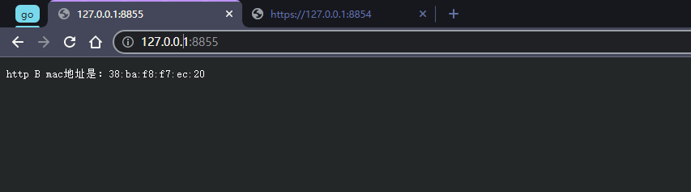

# 题目
两台Linux系统设备A（10.18.13.100）和B（10.18.13.101），我希望在A的浏览器输入http://127.0.0.1:8855 浏览器里面显示：“http B mac地址是：xxxxx”（xxxx是B设备的第一个网卡的mac地址。）在A的浏览器输入https://127.0.0.1:8854 浏览器里面显示 “https B mac地址是：xxxxx”。A和B的之间用9222端口tcp连接且仅B上面有web服务。
A和B之间用一个tcp 连接，而且两边都用9222 端口，web服务在B服务器中。


# https，生成TLS证书和私钥文件
```
openssl genrsa -out server.key 2048\n
openssl req -new -key server.key -out server.csr
openssl x509 -req -days 365 -in server.csr -signkey server.key -out server.crt
```

# 运行效果
1. http://127.0.0.1:8855请求

2. https://127.0.0.1:8854请求
