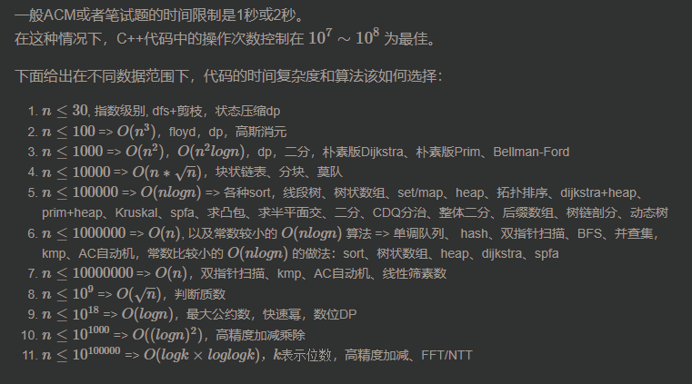

# 时间复杂度分析

一般ACM或者笔试题的时间限制是1秒或2秒。  
在这种情况下，C++代码中的操作次数控制在 10^7 ~ 10^8 为最佳。

下面给出在不同数据范围下，代码的时间复杂度和算法该如何选择：

1.  n≤30, 指数级别, dfs+剪枝，状态压缩dp
2.  n≤100 => O(n^3)，floyd，dp，高斯消元
3.  n≤1000 => O(n^2)，O(n^2logn)，dp，二分，朴素版Dijkstra、朴素版Prim、Bellman-Ford
4.  n≤10000 => O(n∗√n)，块状链表、分块、莫队
5.  n≤100000 => O(nlogn) => 各种sort，线段树、树状数组、set/map、heap、拓扑排序、dijkstra+heap、prim+heap、Kruskal、spfa、求凸包、求半平面交、二分、CDQ分治、整体二分、后缀数组、树链剖分、动态树
6.  n≤1000000 => O(n), 以及常数较小的 O(nlogn)O(nlogn)O(nlogn) 算法 => 单调队列、 hash、双指针扫描、BFS、并查集，kmp、AC自动机，常数比较小的 O(nlogn)O(nlogn)O(nlogn) 的做法：sort、树状数组、heap、dijkstra、spfa
7.  n≤10000000 => O(n)，双指针扫描、kmp、AC自动机、线性筛素数
8.  n≤10^9 => O(√n)，判断质数
9.  n≤10^18 => O(logn)，最大公约数，快速幂，数位DP
10.  n≤10^1000 => O((logn)^2)，高精度加减乘除
11.  n≤10^100000 => O(logk×loglogk),k表示位数，高精度加减、FFT/NTT



[来源](https://www.acwing.com/file_system/file/content/whole/index/content/3074/)


# 具体方法


## 纯循环

有几重循环就有几次方，比如：

```cpp
for (int i = 0; i < n; i ++ )
    for (int j = 0; j < n; j ++ )
        for (int k = 0; k < n; k ++ )
            // O(n^3)
``` 

## 递归

* 可以采用[主定理](https://baike.baidu.com/item/主定理/3463232)直接套公式。（不过个人觉得有点太复杂了，可用性不是那么高）
* 分析每一层的时间复杂度，然后大概会执行多少层。例如：快排。每一层是O(n)，大概有logn层，所以时间复杂度是O(nlogn)。


## 双指针

双指针虽然有两层循环，但内层循环变量只加不减，所以时间复杂度是O(n)。
[参考](./1_basicAlgorithm/TheLongestContinuousNon-repeatingSubsequence.go)中内层循环的j变量,j在外层循环声明,作为内层循环次数的条件，所以内层循环具体执行多少次看j。

类似的还有单调栈、kmp、trie字符串统计等。

 
## 动态规划

动态规划问题的计算量= 状态数量 * 状态转移的计算量

