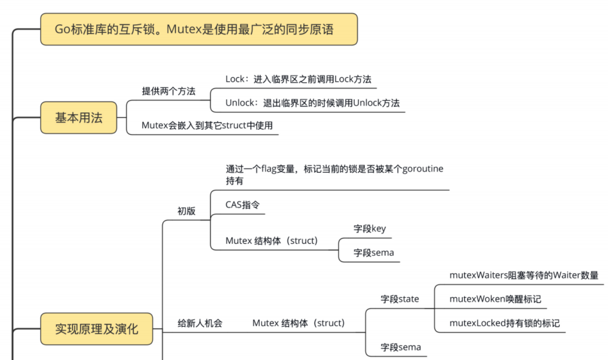

# concurrent-program
`Golang`并发编程学习，案列来自网络，如有侵权，联系删除。


# Go并发技巧

## 命令集合
1. `go tool compile -S file.go`：查看汇编代码命令
2. `go run -race counter.go`：帮助我们自动发现程序有没有 `data race `（数据竞争）的问题。
3. `go vet copy.go`:vet 工具，把检查写在 Makefile 文件中，在持续集成的时候跑一跑，这样可以及时发现**死锁**问题，及时修复
4. 

## race detector
Go 提供的一个检测并发访问共享资源是否有问题的工具，它可以帮助我们自动发现程序有没有 `data race `（数据竞争）的问题。

* 使用： 
在编译（`compile`）、测试（`test`）或者运行（`run`）Go 代码的时候，加上 `race` 参数，就有可能发现并发问题（编译的时候加上race不能发现data race,但是编译的时候可以开启race参数，这样编译后的程序在运行时就可以data race问题了。但是，绝对不要把带race参数编译的程序部署到线上。）。比如`go run -race counter.go`，就会输出警告信息, 会告诉你哪个 goroutine 在哪一行对哪个变量**有写**操作，同时，哪个`goroutine`
  在哪一行对哪个变量**有读**操作，就是这些并发的读写访问，引起了 `data race`。
* 缺陷：虽然这个工具使用起来很方便，但是，因为它的实现方式，**只能通过真正对实际地址进行
  读写访问的时候才能探测，所以它并不能在编译的时候发现 data race 的问题。而且，在
  运行的时候，只有在触发了 data race 之后，才能检测到**，如果**碰巧没有触发**（比如一个
  data race 问题只能在 2 月 14 号零点或者 11 月 11 号零点才出现），**是检测不出来的**。而且，把开启了 race 的程序部署在线上，还是比较*影响性能*的。

总结一下，通过在编译的时候插入一些指令，在运行时通过这些插入的指令检测并发读写
从而发现 data race 问题，就是这个工具的实现机制。(`go tool compile -
race -S counter.go`)
> 相关案例：
> 比如 `Docker issue` 37583、35517、32826、30696等、`kubernetes issue`
72361、71617等，都是后来发现的 data race 而采用互斥锁 Mutex 进行修复的。


## CAS
CAS 指令将给定的值和一个内存地址中的值进行比较，如果它们是同一个值，就使用新值替换内存地址中的值，这个操作是原子性的。


## Mutex

* `Unlock` 方法可以被任意的 goroutine 调用释放锁，即使是没持有这个互斥锁的 goroutine，也可以进行这个操作。这是因为，Mutex 本身并没有包含持有这把锁的goroutine 的信息，所以，Unlock 也不会对此进行检查。Mutex 的这个设计一直保至今。所以，我们在使用 Mutex 的时候，必须要保证 goroutine 尽可能不去释放自己未持有的锁，一定要遵循“谁申请，谁释放”的原则。在真实的实践中，我们使用互斥锁的时候，很少在一个方法中单独申请锁，而在另外一个方法中单独释放锁，一般都会在同一个方法中获取锁和释放锁。

### 常见四种错误使用场景
1. Lock/Unlock 不是成对出现，就意味着会出现死锁的情况，或者是因为 Unlock 一个未加锁的 Mutex 而导致 panic。
2. 误用是 Copy 已使用的 Mutex。Mutex 是一个有状态的对象，它的 state 字段记录这个锁的状态。如果你要复制一个已经加锁的 Mutex 给一个新的变量，那么新的刚初始化的变量居然被加锁了，这显然不符合你的期望，因为你期望的是一个零值的 Mutex。关键是在并发环境下，你根本不知道要复制的 Mutex 状态是什么，因为要复制的 Mutex 是由其它 goroutine 并发访问的，状态可能总是在变化。例子：
    ```go
    type Counter struct {
    sync.Mutex
    Count int
    }
    func main() {
    var c Counter
    c.Lock()
    defer c.Unlock()
    c.Count++
    foo(c) // 复制锁
    }
    // 这里Counter的参数是通过复制的方式传入的
    func foo(c Counter) {
    c.Lock()
    defer c.Unlock()
    fmt.Println("in foo") 
    }
    ```
   可以使用 vet 工具，把检查写在 Makefile 文件中，在持续集成的时候跑一跑，这样可以及时发现问题，及时修复死锁：`go vet copy.go`
3. 可重入锁：当一个线程获取锁时，如果没有其它线程拥有这个锁，那么，这个线程就成功获取到这个锁。之后，如果其它线程再请求这个锁，就会处于阻塞等待的状态。但是，如果拥有这把 锁的线程再请求这把锁的话，不会阻塞，而是成功返回，所以叫可重入锁（有时候也叫做 递归锁）。只要你拥有这把锁，你可以可着劲儿地调用，比如通过递归实现一些算法，调 用者不会阻塞或者死锁。**Mutex 不是可重入的锁。**因为 Mutex 的实现中没有记录哪个 goroutine 拥有这把锁。理论上，任何goroutine 都可以随意地 Unlock 这把锁，所以没办法计算重入条件。所以，一旦误用 Mutex 的重入，就会导致报错。例子：
   ```go
    func foo(l sync.Locker) {
    fmt.Println("in foo")
    l.Lock()
    bar(l)
    l.Unlock()
    }
    func bar(l sync.Locker) {
    l.Lock()
    fmt.Println("in bar")
    l.Unlock()
    }
    func main() {
    l := &sync.Mutex{}
    foo(l)
    }
   ```
   虽然标准库 Mutex 不是可重入锁，但是我们就自己实现一个。
   1. 方案一：通过 hacker 的方式获取到 goroutine id，记录下获取锁的 goroutine id，它可以实现 Locker 接口。 
   2. 方案二：调用 Lock/Unlock 方法时，由 goroutine 提供一个 token，用来标识它自 己，而不是我们通过 hacker 的方式获取到 goroutine id，但是，这样一来，就不满足Locker 接口了。
4. 死锁。死锁产生的必要条件。如果你想避免死锁，只要破坏这四个条件中的一个
   或者几个，就可以了。
   1. 互斥： 至少一个资源是被排他性独享的，其他线程必须处于等待状态，直到资源被释 放。
   2. 持有和等待：goroutine 持有一个资源，并且还在请求其它 goroutine 持有的资源，也就是咱们常说的“吃着碗里，看着锅里”的意思。
   3. 不可剥夺：资源只能由持有它的 goroutine 来释放。 
   4. 环路等待：一般来说，存在一组等待进程，P={P1，P2，…，PN}，P1 等待 P2 持有的资源，P2 等待 P3 持有的资源，依此类推，最后是 PN 等待 P1 持有的资源，这就形成了一个环路等待的死结。

### mutex总结



