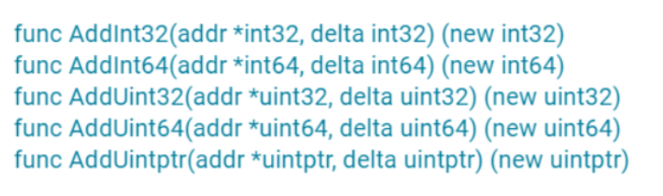
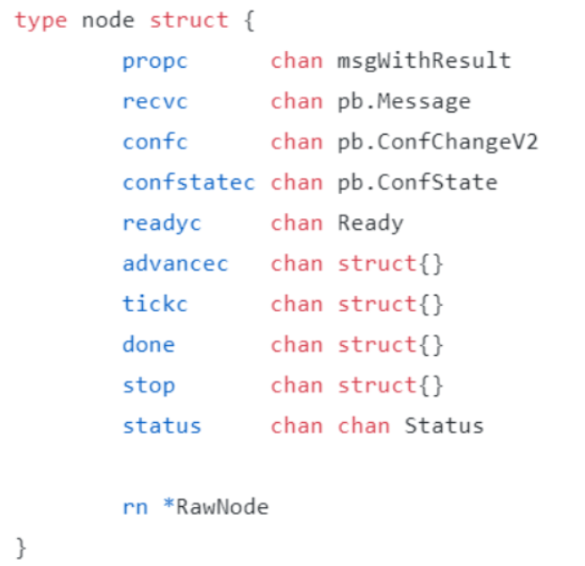

# concurrent-program
`Golang`并发编程学习，案列来自网络，如有侵权，联系删除。


# Go并发技巧

## 命令集合
1. `go tool compile -S file.go`：查看汇编代码命令
2. `go run -race counter.go`：帮助我们自动发现程序有没有 `data race `（数据竞争）的问题。
3. `go vet copy.go`:vet 工具，把检查写在 Makefile 文件中，在持续集成的时候跑一跑，这样可以及时发现**死锁**问题，及时修复
4. 

## race detector
Go 提供的一个检测并发访问共享资源是否有问题的工具，它可以帮助我们自动发现程序有没有 `data race `（数据竞争）的问题。

* 使用： 
在编译（`compile`）、测试（`test`）或者运行（`run`）Go 代码的时候，加上 `race` 参数，就有可能发现并发问题（编译的时候加上race不能发现data race,但是编译的时候可以开启race参数，这样编译后的程序在运行时就可以data race问题了。但是，绝对不要把带race参数编译的程序部署到线上。）。比如`go run -race counter.go`，就会输出警告信息, 会告诉你哪个 goroutine 在哪一行对哪个变量**有写**操作，同时，哪个`goroutine`
  在哪一行对哪个变量**有读**操作，就是这些并发的读写访问，引起了 `data race`。
* 缺陷：虽然这个工具使用起来很方便，但是，因为它的实现方式，**只能通过真正对实际地址进行
  读写访问的时候才能探测，所以它并不能在编译的时候发现 data race 的问题。而且，在
  运行的时候，只有在触发了 data race 之后，才能检测到**，如果**碰巧没有触发**（比如一个
  data race 问题只能在 2 月 14 号零点或者 11 月 11 号零点才出现），**是检测不出来的**。而且，把开启了 race 的程序部署在线上，还是比较*影响性能*的。

总结一下，通过在编译的时候插入一些指令，在运行时通过这些插入的指令检测并发读写
从而发现 data race 问题，就是这个工具的实现机制。(`go tool compile -
race -S counter.go`)
> 相关案例：
> 比如 `Docker issue` 37583、35517、32826、30696等、`kubernetes issue`
72361、71617等，都是后来发现的 data race 而采用互斥锁 Mutex 进行修复的。


## CAS
CAS 指令将给定的值和一个内存地址中的值进行比较，如果它们是同一个值，就使用新值替换内存地址中的值，这个操作是原子性的。

## go:linkname
go:linkname 是 Go 语言的一个编译器指令，它可以将一个 Go 语言的标识符链接到另一个标识符。这个指令通常用于实现一些底层的功能，例如访问和修改运行时系统的内部状态。

go:linkname 指令的语法是：
```go
//go:linkname localname importpath.name
```
其中，`localname` 是本地的标识符，`importpath.name` 是要链接的标识符。这个指令会将 localname 链接到 importpath.name，这样在代码中就可以通过 localname 来访问和修改 importpath.name 的值。

需要注意的是，go:linkname 指令**会破坏 Go 语言的封装性，因为它可以访问和修改任何标识符，包括私有的标识符**。因此，除非你非常清楚你在做什么，否则不应该使用这个指令。

## Mutex
* `state`:
    
* `race.Enabled`:
    
  这行代码是用于`数据竞态检测`的。如果启用了数据竞态检测，那么就调用 `race.Acquire` 函数来记录这个互斥锁的获取操作。这个函数的参数是互斥锁的地址，转换为 unsafe.Pointer 类型。数据竞态（Race Condition）是多线程或多进程环境中的一个问题，当两个或更多的并发操作访问和修改同一块内存区域，且操作的顺序会影响结果时，就可能发生数据竞态。
    `数据竞态检测（Race Detection）`是一种技术，用于检测程序中是否存在数据竞态。在 Go 语言中，可以通过在 go 命令后添加` -race `参数来启用数据竞态检测，例如 `go run -race myprogram.go`。_启用数据竞态检测后，Go 运行时会监控内存访问，以检测并报告数据竞态。_
    在代码中，race.Enabled 是一个布尔值，表示是否启用了数据竞态检测。race.Acquire 函数用于记录一个内存访问操作，这个操作是获取互斥锁。如果存在数据竞态，那么 race.Acquire 函数会报告一个错误。
    > go语言底层库：

     Go 语言的 runtime 包是一个特殊的包，它的很多函数都是在 Go 语言的运行时系统中实现的，这些实现通常是用 C 或者汇编语言编写的，而不是 Go 语言。
    例如，`runtime_canSpin` 函数，它的声明在 runtime 包的 Go 语言源代码中，但是它的实现在运行时系统的 C 语言源代码中。
    这是因为 runtime 包的函数需要执行一些底层的操作，例如**操作系统调用、内存管理、垃圾回收、goroutine 调度**等，这些操作需要直接访问和操作硬件和操作系统，所以它们不能用 Go 语言实现，必须用更底层的语言实现。
    这也是为什么在 runtime 包的 Go 语言源代码中看不到这些函数的实现的原因。如果想看这些函数的实现，你需要查看 Go 语言的运行时系统的源代码，这些源代码通常在 Go 语言的源代码库的 `src/runtime` 目录下。

* `Unlock` 方法可以被任意的 goroutine 调用释放锁，即使是没持有这个互斥锁的 goroutine，也可以进行这个操作。这是因为，Mutex 本身并没有包含持有这把锁的goroutine 的信息，所以，Unlock 也不会对此进行检查。Mutex 的这个设计一直保至今。所以，我们在使用 Mutex 的时候，必须要保证 goroutine 尽可能不去释放自己未持有的锁，一定要遵循“谁申请，谁释放”的原则。在真实的实践中，我们使用互斥锁的时候，很少在一个方法中单独申请锁，而在另外一个方法中单独释放锁，一般都会在同一个方法中获取锁和释放锁。

### 互斥锁的几种状态
在并发编程中，互斥锁（Mutex）是一种常用的同步机制，用于保护共享资源的访问。互斥锁有几种状态，包括加锁、唤醒和饥饿：
* 加锁（Locked）：当一个线程成功获取到互斥锁时，我们说互斥锁处于加锁状态。在这种状态下，其他试图获取锁的线程将会被阻塞，
直到锁被释放
* 唤醒（Woken）：当一个等待锁的线程被唤醒（即被通知可以尝试获取锁）时，我们说互斥锁处于唤醒状态。这通常发生
在锁被释放时，系统会从等待队列中唤醒一个或多个线程来尝试获取锁。
* 饥饿（Starving）：当一个线程长时间等待获取锁，但总是被其他线程抢先获取，我们说这个线程处于饥饿状态。为了防止饥饿，一些
互斥锁的实现会提供公平锁机制，即按照线程到达的顺序分配锁，这样可以保证每个线程最终都能获取到锁。在`3_tryLock_demo.go`代码中，mutexLocked、
mutexWoken 和 mutexStarving 是用来表示互斥锁的这三种状态的常量。它们的值是通过位操作得到的，这样可以在一个 int32 变量中
同时存储多个状态。

### 常见四种错误使用场景
1. Lock/Unlock 不是成对出现，就意味着会出现死锁的情况，或者是因为 Unlock 一个未加锁的 Mutex 而导致 panic。
2. 误用是 Copy 已使用的 Mutex。Mutex 是一个有状态的对象，它的 state 字段记录这个锁的状态。如果你要复制一个已经加锁的 Mutex 给一个新的变量，那么新的刚初始化的变量居然被加锁了，这显然不符合你的期望，因为你期望的是一个零值的 Mutex。关键是在并发环境下，你根本不知道要复制的 Mutex 状态是什么，因为要复制的 Mutex 是由其它 goroutine 并发访问的，状态可能总是在变化。例子：
    ```go
    type Counter struct {
    sync.Mutex
    Count int
    }
    func main() {
    var c Counter
    c.Lock()
    defer c.Unlock()
    c.Count++
    foo(c) // 复制锁
    }
    // 这里Counter的参数是通过复制的方式传入的
    func foo(c Counter) {
    c.Lock()
    defer c.Unlock()
    fmt.Println("in foo") 
    }
    ```
   可以使用 vet 工具，把检查写在 Makefile 文件中，在持续集成的时候跑一跑，这样可以及时发现问题，及时修复死锁：`go vet copy.go`
3. 可重入锁：当一个线程获取锁时，如果没有其它线程拥有这个锁，那么，这个线程就成功获取到这个锁。之后，如果其它线程再请求这个锁，就会处于阻塞等待的状态。但是，如果拥有这把 锁的线程再请求这把锁的话，不会阻塞，而是成功返回，所以叫可重入锁（有时候也叫做 递归锁）。只要你拥有这把锁，你可以可着劲儿地调用，比如通过递归实现一些算法，调 用者不会阻塞或者死锁。**Mutex 不是可重入的锁。**因为 Mutex 的实现中没有记录哪个 goroutine 拥有这把锁。理论上，任何goroutine 都可以随意地 Unlock 这把锁，所以没办法计算重入条件。所以，一旦误用 Mutex 的重入，就会导致报错。例子：
   ```go
    func foo(l sync.Locker) {
    fmt.Println("in foo")
    l.Lock()
    bar(l)
    l.Unlock()
    }
    func bar(l sync.Locker) {
    l.Lock()
    fmt.Println("in bar")
    l.Unlock()
    }
    func main() {
    l := &sync.Mutex{}
    foo(l)
    }
   ```
   虽然标准库 Mutex 不是可重入锁，但是我们就自己实现一个。
   1. 方案一：通过 hacker 的方式获取到 goroutine id，记录下获取锁的 goroutine id，它可以实现 Locker 接口。 
   2. 方案二：调用 Lock/Unlock 方法时，由 goroutine 提供一个 token，用来标识它自 己，而不是我们通过 hacker 的方式获取到 goroutine id，但是，这样一来，就不满足Locker 接口了。
4. 死锁。死锁产生的必要条件。如果你想避免死锁，只要破坏这四个条件中的一个
   或者几个，就可以了。
   1. 互斥： 至少一个资源是被排他性独享的，其他线程必须处于等待状态，直到资源被释 放。
   2. 持有和等待：goroutine 持有一个资源，并且还在请求其它 goroutine 持有的资源，也就是咱们常说的“吃着碗里，看着锅里”的意思。
   3. 不可剥夺：资源只能由持有它的 goroutine 来释放。 
   4. 环路等待：一般来说，存在一组等待进程，P={P1，P2，…，PN}，P1 等待 P2 持有的资源，P2 等待 P3 持有的资源，依此类推，最后是 PN 等待 P1 持有的资源，这就形成了一个环路等待的死结。

### mutex总结


## RWMutex读写锁
标准库中的 RWMutex 是一个 reader/writer 互斥锁。RWMutex 在某一时刻只能由**任意数量的 reader 持有**，或者是**只被单个的 writer 持有**。

RWMutex 的方法也很少，总共有 5 个:
1. `Lock/Unlock`：**写**操作时调用的方法。如果锁已经被 reader 或者 writer 持有，那么，
Lock 方法会一直阻塞，直到能获取到锁；Unlock 则是配对的释放锁的方法。
2. `RLock/RUnlock`：**读**操作时调用的方法。如果锁已经被 writer 持有的话，RLock 方法
会一直阻塞，直到能获取到锁，否则就直接返回；而 RUnlock 是 reader 释放锁的方
法。
3. `RLocker`：这个方法的作用是**为读操作返回一个 Locker 接口的对象**。它的 Lock 方法会
调用 RWMutex 的 RLock 方法，它的 Unlock 方法会调用 RWMutex 的 RUnlock 方
法
> RWMutex 的零值是未加锁的状态，所以，当你使用 RWMutex 的时候，无论是声明变
量，还是嵌入到其它 struct 中，**都不必显式地初始化**.
> 遇到可以明确区分 reader 和 writer goroutine 的场景，且有大量的并发读、少量
的并发写，并且有强烈的性能需求，你就可以考虑使用读写锁 RWMutex 替换 Mutex
>

### RWMutex 的实现原理
RWMutex 是很常见的并发原语，很多编程语言的库都提供了类似的并发类型。RWMutex
一般都是**基于互斥锁、条件变量（condition variables）或者信号量（semaphores）**等
并发原语来实现。Go 标准库中的 RWMutex 是基于 Mutex 实现的。
`readers-writers `问题一般有三类，基于对读和写操作的优先级，读写锁的设计和实现也分
成三类:
1. `Read-preferring`：读优先的设计可以提供很高的并发性，但是，在竞争激烈的情况下
可能会导致**写饥饿**。这是因为，如果有大量的读，这种设计会导致只有所有的读都释放
了锁之后，写才可能获取到锁。
2. `Write-preferring`：写优先的设计意味着，如果已经有一个 writer 在等待请求锁的
话，它会阻止新来的请求锁的 reader 获取到锁，所以优先保障 writer。当然，如果有
一些 reader 已经请求了锁的话，新请求的 writer 也会等待已经存在的 reader 都释放
锁之后才能获取。所以，写优先级设计中的优先权是针对新来的请求而言的。这种设计
主要避免了 writer 的饥饿问题,但是可能会导致**读饥饿**。
3. 不指定优先级：这种设计比较简单，不区分 reader 和 writer 优先级，某些场景下这种
不指定优先级的设计反而更有效，因为第一类优先级会导致写饥饿，第二类优先级可能会导致读饥饿，这种不指定优先级的访问不再区分读写，大家都是同一个优先级，解决了饥饿的问题。
> Go 标准库中的 RWMutex 设计是 Write-preferring 方案。一个正在阻塞的 Lock 调用
会排除新的 reader 请求到锁。
>
RWMutex 包含一个 Mutex，以及四个辅助字段 writerSem、readerSem、readerCount
和 readerWait：
```go
type RWMutex struct {
w Mutex // 互斥锁解决多个writer的竞争
writerSem uint32 // writer信号量
readerSem uint32 // reader信号量
readerCount int32 // reader的数量
readerWait int32 // writer等待完成的reader的数量
}
const rwmutexMaxReaders = 1 << 30
```
1. 字段 w：为 writer 的竞争锁而设计；
2. 字段 readerCount：记录当前 reader 的数量（以及是否有 writer 竞争锁）；
   * 没有 writer 竞争或持有锁时，readerCount 和我们正常理解的 reader 的计数是一样
   的；
   * 但是，如果有 writer 竞争锁或者持有锁时，那么，readerCount 不仅仅承担着 reader
   的计数功能，还能够标识当前是否有 writer 竞争或持有锁，在这种情况下，请求锁的
   reader 的处理变成阻塞等待锁的释放。
3. readerWait：记录 writer 请求锁时需要等待 read 完成的 reader 的数量；
4. writerSem 和 readerSem：都是为了阻塞设计的信号量。
5. 常量 rwmutexMaxReaders，定义了最大的 reader 数量。

#### RWMutex 的 RLock、RUlock、rUnlockSlow 方法


1.  `Add` 的返回值还有另外一个含义。如果它是**负值**，就表示当前**有 writer 竞争锁**，在这种情况下，还会调用 rUnlockSlow 方法，检查是不是reader 都释放读锁了，如果读锁都释放了，那么可以唤醒请求写锁的 writer 了。当一个或者多个 reader 持有锁的时候，竞争锁的 writer 会等待这些 reader 释放完，才可能持有这把锁。


#### RWMutex 的 Lock、Unlock、unlockSlow 方法
1. Lock:

RWMutex 是一个多 writer 多 reader 的读写锁，所以同时可能有多个 writer 和 reader。
那么，为了避免 writer 之间的竞争，RWMutex 就会使用一个 Mutex 来保证 writer 的互
斥。<br/>
一旦一个 writer 获得了内部的互斥锁，就会反转 readerCount 字段，把它从原来的正整
数 readerCount(>=0) 修改为负数（readerCount-rwmutexMaxReaders），让这个字段
保持两个含义（既保存了 reader 的数量，又表示当前有 writer）。<br/>
如果 readerCount 不是 0，就说明当前有持有读锁的 reader，RWMutex 需要把这个当
前 readerCount 赋值给 readerWait 字段保存下来， 同时，这个 writer 进入
阻塞等待状态。
每当一个 reader 释放读锁的时候（调用 RUnlock 方法时），readerWait 字段就减 1，直
到所有的活跃的 reader 都释放了读锁，才会唤醒这个 writer。
2. Unlock: 

当一个 writer 释放锁的时候，它会再次反转 readerCount 字段。这里的反转方法就是给它增加
rwmutexMaxReaders 这个常数值。<br/>
既然 writer 要释放锁了，那么就需要唤醒之后新来的 reader，不必再阻塞它们了，让它们
开开心心地继续执行就好了。<br/>
在 RWMutex 的 Unlock 返回之前，需要把内部的互斥锁释放。释放完毕后，其他的
writer 才可以继续竞争这把锁。


### RWMutex 3个踩坑点
1. 不可复制.
前面刚刚说过，RWMutex 是由一个互斥锁和四个辅助字段组成的。我们很容易想到，互斥锁是不可复制的，再加上四个有状态的字段，RWMutex 就更加不能复制使用了。不能复制的原因和互斥锁一样。一旦读写锁被使用，它的字段就会记录它当前的一些状态。这个时候你去复制这把锁，就会把它的状态也给复制过来。但是，原来的锁在释放的时候，并不会修改你复制出来的这个读写锁，这就会导致复制出来的读写锁的状态不对，可能永远无法释放锁.那该怎么办呢？其实，解决方案也和互斥锁一样。你可以借助 vet 工具，在变量赋值、函数传参、函数返回值、遍历数据、struct 初始化等时，检查是否有读写锁隐式复制的情景。
2. 重入导致死锁. 三种情况：
   * 因为读写锁内部基于互斥锁实现对 writer 的并发访问，而互斥锁本身是有重入问题的，所以，writer 重入调用 Lock 的时候，就会出现死锁的现象.例子：[2_reentrant_deat_lock.go](study-project-1%2F2_RWMutex%2F2_reentrant_deat_lock.go)
    * 有活跃 reader 的时候，writer 会等待，如果我们在 reader 的读操作时调用 writer 的写操作（它会调用 Lock 方法），那么，这个 reader和 writer 就会形成互相依赖的死锁状态。Reader 想等待 writer 完成后再释放锁，而writer 需要这个 reader 释放锁之后，才能不阻塞地继续执行。这是一个读写锁常见的死锁场景。 
    * 当一个 writer 请求锁的时候，如果已经有一些活跃的 reader，它会等待这些活跃的reader 完成，才有可能获取到锁，但是，如果之后活跃的 reader 再依赖新的 reader 的话，这些新的 reader 就会等待 writer 释放锁之后才能继续执行，这就形成了一个环形依赖： writer 依赖活跃的 reader -> 活跃的 reader 依赖新来的 reader -> 新来的 reader依赖 writer。例子：[3_reetrant_n_factorial.go](study-project-1%2F2_RWMutex%2F3_reetrant_n_factorial.go)
        
   > 所以，使用读写锁最需要注意的一点就是尽量避免重入，重入带来的死锁非常隐蔽，而且
   难以诊断。
   > 
3. 释放未加锁的 RWMutex
   和互斥锁一样，Lock 和 Unlock 的调用总是成对出现的，RLock 和 RUnlock 的调用也必
   须成对出现。Lock 和 RLock 多余的调用会导致锁没有被释放，可能会出现死锁，而Unlock 和 RUnlock 多余的调用会导致 panic.

### RWMutex 总结


## WaitGroup协同等待，任务编排利器
WaitGroup 很简单，就是 package sync 用来做任务编排的一个并发原语。它要解决的就是并发 - 等待的问题： 现在有一个 goroutine A 在检查点（checkpoint）等待一组 goroutine 全部完成，如果在执行任务的这些 goroutine 还没全部完成，那么 goroutine A 就会阻塞在检查点，直到所有 goroutine 都完成后才能继续执行。

Go 标准库中的 WaitGroup 提供了三个方法:
1. `Add`，用来设置 WaitGroup 的计数值；
2. `Done`，用来将 WaitGroup 的计数值减 1，其实就是调用了 Add(-1)；
3. `Wait`，调用这个方法的 goroutine 会一直阻塞，直到 WaitGroup 的计数值变为 0

基本示例：[1_concurrent_count.go](study-project-1%2F3_WaitGroup%2F1_concurrent_count.go)

### WaitGroup 的实现原理
WaitGroup 的数据结构。它包括了一个 noCopy 的辅助字段，一个state 记录 WaitGroup 状态的数组。
1. `noCopy` 的辅助字段，主要就是辅助 vet 工具检查是否通过 copy 赋值这个 WaitGroup
实例。我会在后面和你详细分析这个字段；
2. `state`，一个具有复合意义的字段，包含 WaitGroup 的计数、阻塞在检查点的 waiter
数和信号量。<br/>
WaitGroup 的数据结构定义以及 state 信息的获取方法如下：
```go
//1.21.4 go版本已经修改了，新增sema  uint32字段
type WaitGroup struct {
// 避免复制使用的一个技巧，可以告诉vet工具违反了复制使用的规则
noCopy noCopy
// 64bit(8bytes)的值分成两段，高32bit是计数值，低32bit是waiter的计数
// 另外32bit是用作信号量的
// 因为64bit值的原子操作需要64bit对齐，但是32bit编译器不支持，所以数组中的元素在不同的
// 总之，会找到对齐的那64bit作为state，其余的32bit做信号量
state1 [3]uint32
}
```

#### Add 方法
Add 方法主要操作的是 state 的计数部分。你可以为计数值增加一个 delta 值，内部通过原子操作把这个值加到计数值上。需要注意的是，这个 delta 也可以是个负数，相当于为计数值减去一个值，Done 方法内部其实就是通过Add(-1) 实现的。


#### Done 方法
Done 方法其实就是调用了 Add(-1)。它会把计数值减 1，如果计数值变为 0，就会唤醒所有阻塞在 Wait 方法上的 goroutine。
```go
func (wg *WaitGroup) Done() {
	wg.Add(-1)
}
```

#### Wait 方法
Wait 方法的实现逻辑是：不断检查 state 的值。如果其中的计数值变为了 0，那么说明所有的任务已完成，调用者不必再等待，直接返回。如果计数值大于 0，说明此时还有任务没完成，那么调用者就变成了等待者，需要加入 waiter 队列，并且阻塞住自己。


### WaitGroup 的常见错误

#### 计数器设置为负值
WaitGroup 的计数器的值必须大于等于 0。我们在更改这个计数值的时候，WaitGroup 会先做检查，如果计数值被设置为负数，就会导致 panic。一般情况下，有两种方法会导致计数器设置为负数：
1. 调用 Add 的时候传递一个负数。如果你能保证当前的计数器加上这个负数后还是大于等于 0 的话，也没有问题，否则就会导致 panic。
    ```go
    func main() {
    var wg sync.WaitGroup
    wg.Add(10)
    wg.Add(-10)//将-10作为参数调用Add，计数值被设置为0
    wg.Add(-1)//将-1作为参数调用Add，如果加上-1计数值就会变为负数。这是不对的，所以会触发panic
    }
    ```
2. 调用 Done 方法的次数过多，超过了 WaitGroup 的计数值。<br/>
   使用 WaitGroup 的正确姿势是，预先确定好 WaitGroup 的计数值，然后调用相同次数的 Done 完成相应的任务。比如，在 WaitGroup 变量声明之后，就立即设置它的计数值，或者在 goroutine 启动之前增加 1，然后在 goroutine 中调用 Done。
    ```go
    func main() {
    var wg sync.WaitGroup
    wg.Add(1)
    wg.Done()
    wg.Done()
    }
    ```
   
#### 不期望的 Add 时机
在使用 WaitGroup 的时候，你一定要遵循的原则就是，等所有的 Add 方法调用之后再调用 Wait，否则就可能导致 panic 或者不期望的结果。
```go
func main() {
var wg sync.WaitGroup
go dosomething(100, &wg) // 启动第一个goroutine
go dosomething(110, &wg) // 启动第二个goroutine
go dosomething(120, &wg) // 启动第三个goroutine
go dosomething(130, &wg) // 启动第四个goroutine
wg.Wait() // 主goroutine等待完成
fmt.Println("Done")
}
func dosomething(millisecs time.Duration, wg *sync.WaitGroup) {
duration := millisecs * time.Millisecond
time.Sleep(duration) // 故意sleep一段时间
wg.Add(1)
fmt.Println("后台执行, duration:", duration)
wg.Done()
}
```
在这个例子中，我们原本设想的是，等四个 goroutine 都执行完毕后输出 Done 的信息，
但是它的错误之处在于，**将 WaitGroup.Add 方法的调用放在了子 gorotuine 中**。等主
goorutine 调用 Wait 的时候，因为四个任务 goroutine 一开始都休眠，所以*可能
WaitGroup 的 Add 方法还没有被调用，WaitGroup 的计数还是 0，所以它并没有等待四
个子 goroutine 执行完毕才继续执行，而是立刻执行了下一步。*
导致这个错误的原因是，没有遵循先完成所有的 Add 之后才 Wait。要解决这个问题，一
个方法是，预先设置计数值,在启动协程之前设置。<br/>
另一种修复是在启动子 goroutine 之前才调用 Add：
```go
func main() {
var wg sync.WaitGroup
dosomething(100, &wg) // 调用方法，把计数值加1，并启动任务goroutine
dosomething(110, &wg) // 调用方法，把计数值加1，并启动任务goroutine
dosomething(120, &wg) // 调用方法，把计数值加1，并启动任务goroutine
dosomething(130, &wg) // 调用方法，把计数值加1，并启动任务goroutine
wg.Wait() // 主goroutine等待，代码逻辑保证了四次Add(1)都已经执行完了
fmt.Println("Done")
}
func dosomething(millisecs time.Duration, wg *sync.WaitGroup) {
wg.Add(1) // 计数值加1，再启动goroutine
go func() {
duration := millisecs * time.Millisecond
time.Sleep(duration)
fmt.Println("后台执行, duration:", duration)
wg.Done()
}()
}
```
> 无论是怎么修复，都要保证所有的 Add 方法是在 Wait 方法之前被调用的。
 

#### 前一个 Wait 还没结束就重用 WaitGroup
“前一个 Wait 还没结束就重用 WaitGroup”这一点似乎不太好理解，我借用田径比赛的
例子和你解释下吧。在田径比赛的百米小组赛中，需要把选手分成几组，一组选手比赛完
之后，就可以进行下一组了。为了确保两组比赛时间上没有冲突，我们在模型化这个场景
的时候，可以使用 WaitGroup。<br/>
WaitGroup 等一组比赛的所有选手都跑完后 5 分钟，才开始下一组比赛。下一组比赛还可
以使用这个 WaitGroup 来控制，因为 WaitGroup 是可以重用的。只要 WaitGroup 的计
数值恢复到零值的状态，那么它就可以被看作是新创建的 WaitGroup，被重复使用.看一个例子，初始设置 WaitGroup 的计数值为 1，启动一个 goroutine 先调 用 Done 方法，接着就调用 Add 方法，Add 方法有可能和主 goroutine 并发执行。
```go
func main() {
var wg sync.WaitGroup
wg.Add(1)
go func() {
time.Sleep(time.Millisecond)
wg.Done() // 计数器减1
wg.Add(1) // 计数值加1
}()
wg.Wait() // 主goroutine等待，有可能在done结束之后和add并发执行。
}
```
在这个例子中，done虽然让 WaitGroup 的计数恢复到 0，但是主goroutine有个 waiter在等待，如果等待 Wait 的主goroutine，刚被唤醒就和 Add 调用的子goroutine有并发执行的冲突，所以就会出现 panic。
> WaitGroup 虽然可以重用，但是是有一个前提的，那就是必须等到上一轮的
Wait 完成之后，才能重用 WaitGroup 执行下一轮的 Add/Wait，如果你在 Wait 还没执
行完的时候就调用下一轮 Add 方法，就有可能出现 panic。


### noCopy：辅助 vet 检查
我们刚刚在学习 WaitGroup 的数据结构时，提到了里面有一个 noCopy 字段。你还记得它的作用吗？其实，它就是指示 vet 工具在做检查的时候，这个数据结构不能做值复制使用。更严谨地说，是不能在第一次使用之后复制使用 ( must not be copied after first use).<br/>
vet 会对实现 Locker 接口的数据类型做静态检查，一旦代码中有复制使用这种数据类型的情况，就会发出警告。
通过给 WaitGroup 添加一个 noCopy 字段，我们就可以为 WaitGroup
实现 Locker 接口，这样 vet 工具就可以做复制检查了。而且因为 noCopy 字段是未输出
类型，所以 WaitGroup 不会暴露 Lock/Unlock 方法。
> 如果你想要自己定义的数据结构不被复制使用，或者说，不能通过 vet 工具检查出复制使
用的报警，就可以通过嵌入 noCopy 这个数据类型来实现。

例子： 
```go
type TestStruct struct {
Wait sync.WaitGroup
}
func main() {
w := sync.WaitGroup{}
w.Add(1)
t := &TestStruct{
Wait: w,
}
t.Wait.Done()
fmt.Println("Finished")
}
```
这段代码最大的一个问题，就是第 9 行 copy 了 WaitGroup 的实例 w。虽然这段代码能执行成功，但确实是违反了 WaitGroup 使用之后不要复制的规则。在项目中，我们可以通过 vet 工具检查出这样的错误。

### 如何避免 WaitGroup 的常见错误
只需要尽量保证下面 5 点就可以了：
1. 不重用 WaitGroup。新建一个 WaitGroup 不会带来多大的资源开销，重用反而更容易出错。
2. 保证所有的 Add 方法调用都在 Wait 之前。
3. 不传递负数给 Add 方法，只通过 Done 来给计数值减 1。
4. 不做多余的 Done 方法调用，保证 Add 的计数值和 Done 方法调用的数量是一样的。
5. 不遗漏 Done 方法的调用，否则会导致 Wait hang 住无法返回。

### WaitGroup 总结


## Cond:条件变量
Go 标准库提供 Cond 原语的目的是，为等待 / 通知场景下的并发问题提供支持。Cond 通
常应用于等待某个条件的一组 goroutine，等条件变为 true 的时候，其中一个 goroutine 或者所有的 goroutine 都会被唤醒执行。<br/>
顾名思义，Cond 是和某个条件相关，这个条件需要一组 goroutine 协作共同完成，在条 件还没有满足的时候，所有等待这个条件的 goroutine 都会被阻塞住，只有这一组goroutine 通过协作达到了这个条件，等待的 goroutine 才可能继续进行下去。<br/>
那这里等待的条件是什么呢？等待的条件，可以是某个变量达到了某个阈值或者某个时间点，也可以是一组变量分别都达到了某个阈值，还可以是某个对象的状态满足了特定的条 件。总结来讲，等待的条件是一种可以用来计算结果是 true 还是 false 的条件.<br/>
使用 Cond 的场景比较少，因为一旦遇到需要使用 Cond 的场景，我们更多地会使用 Channel 的方式去实现，因为那才是更地道的 Go 语言的写法。

### Cond 的基本用法
标准库中的 Cond 并发原语初始化的时候，需要关联一个 Locker 接口的实例，一般我们 使用 Mutex 或者 RWMutex。
首先，Cond 关联的 Locker 实例可以通过 c.L 访问，它内部维护着一个先入先出的等待队
列。 然后，我们分别看下它的三个方法 Broadcast、Signal 和 Wait 方法。
1. `Signal` 方法，允许调用者 Caller 唤醒一个等待此 Cond 的 goroutine。如果此时没有等待的 goroutine，显然无需通知 waiter；如果 Cond 等待队列中有一个或者多个等待的 goroutine，则需要从等待队列中移除第一个 goroutine 并把它唤醒。在其他编程语言中，比如 Java 语言中，Signal 方法也被叫做 notify 方法。调用 Signal 方法时，不强求你一定要持有 c.L 的锁。
2. `Broadcast` 方法，允许调用者 Caller 唤醒所有等待此 Cond 的 goroutine。如果此时没有等待的 goroutine，显然无需通知 waiter；如果 Cond 等待队列中有一个或者多个等待的 goroutine，则清空所有等待的 goroutine，并全部唤醒。在其他编程语言中，比如 Java 语言中，Broadcast 方法也被叫做 notifyAll 方法。同样地，调用 Broadcast 方法时，也不强求你一定持有 c.L 的锁。
3. `Wait` 方法，会把调用者 Caller 放入 Cond 的等待队列中并阻塞，直到被 Signal 或者Broadcast 的方法从等待队列中移除并唤醒。调用 Wait 方法时**必须要持有** c.L 的锁。<br/>

例子：[1_cond_example.go](study-project-1%2F4_Cond%2F1_cond_example.go)

### Cond 的实现原理
其实，Cond 的实现非常简单，或者说复杂的逻辑已经被 Locker 或者 runtime 的等待队
列实现了。
```go
type Cond struct {
    noCopy noCopy
    // 当观察或者修改等待条件的时候需要加锁
    L Locker
    // 等待队列
    notify notifyList
    checker copyChecker
}
func NewCond(l Locker) *Cond {
    return &Cond{L: l}
}

func (c *Cond) Wait() {
    c.checker.check()
    // 增加到等待队列中
    t := runtime_notifyListAdd(&c.notify)
    c.L.Unlock()
    // 阻塞休眠直到被唤醒
    runtime_notifyListWait(&c.notify, t)
    c.L.Lock()
}
func (c *Cond) Signal() {
    c.checker.check()
    runtime_notifyListNotifyOne(&c.notify)
}
func (c *Cond) Broadcast() {
    c.checker.check()
    runtime_notifyListNotifyAll(&c.notify)
}
```
runtime_notifyListXXX 是运行时实现的方法，实现了一个等待 / 通知的队列。

copyChecker 是一个辅助结构，可以在运行时检查 Cond 是否被复制使用。

Signal 和 Broadcast 只涉及到 notifyList 数据结构，不涉及到锁。

Wait 把调用者加入到等待队列时会释放锁，在被唤醒之后还会请求锁。在阻塞休眠期间，
调用者是不持有锁的，这样能让其他 goroutine 有机会检查或者更新等待变量。

### Cond 的常见错误
1. 是调用 Wait 的时候没有加锁.
    ```go
    func main() {
        c := sync.NewCond(&sync.Mutex{})
        var ready int
        for i := 0; i < 10; i++ {
            go func(i int) {
                time.Sleep(time.Duration(rand.Int63n(10)) * time.Second)
                // 加锁更改等待条件
                c.L.Lock()
                ready++
                c.L.Unlock()
                log.Printf("运动员#%d 已准备就绪\n", i)
                // 广播唤醒所有的等待者
                c.Broadcast()
            }(i)
        }
        // c.L.Lock() //没加上锁
        for ready != 10 {
            c.Wait()
            log.Println("裁判员被唤醒一次")
        }
        // c.L.Unlock()
        //所有的运动员是否就绪
        log.Println("所有运动员都准备就绪。比赛开始，3，2，1, ......")
    }
    ```
   出现这个问题的原因在于，cond.Wait 方法的实现是，把当前调用者加入到 notify 队列之中后会释放锁（如果不释放锁，其他 Wait 的调用者就没有机会加入到 notify 队列中了），然后一直等待；等调用者被唤醒之后，又会去争抢这把锁。如果调用 Wait 之前不加锁的话，就**有可能 Unlock 一个未加锁的 Locker**。所以切记，调用 cond.Wait 方法之前一定要加锁。
2. 只调用了一次 Wait，没有检查等待条件是否满足，结果条件没满足，程序就继续执行了。出现这个问题的原因在于，误以为 Cond 的使用，就像WaitGroup 那样调用一下 Wait 方法等待那么简单。比如：
    ```go
    func main() {
         c := sync.NewCond(&sync.Mutex{})
         var ready int
		 for i := 0; i < 10; i++ {
            go func(i int) {
                time.Sleep(time.Duration(rand.Int63n(10)) * time.Second)
                // 加锁更改等待条件
                c.L.Lock()
                ready++
                c.L.Unlock()
                log.Printf("运动员#%d 已准备就绪\n", i)
                // 广播唤醒所有的等待者
                c.Broadcast()
            }(i)
         }
         c.L.Lock()
         // for ready != 10 {
         c.Wait()
         log.Println("裁判员被唤醒一次")
         // }
         c.L.Unlock()
         //所有的运动员是否就绪
         log.Println("所有运动员都准备就绪。比赛开始，3，2，1, ......")
    }
    ``` 
      > 一定要记住，waiter goroutine 被唤醒不等于等待条件被满足，只是有
      goroutine 把它唤醒了而已，等待条件有可能已经满足了，也有可能不满足，我们需要进
      一步检查。你也可以理解为，等待者被唤醒，只是得到了一次检查的机会而已。
  
### Cond 总结
如果你想在使用 Cond 的时候避免犯错，只要时刻记住调用 **cond.Wait 方法之前一定要加锁**，以及 **waiter goroutine 被唤醒不等于等待条件被满足**这两个知识点。<br/>
Cond 有三点特性是 Channel 无法替代的：
1. Cond 和一个 Locker 关联，可以利用这个 Locker 对相关的依赖条件更改提供保护。
2. Cond 可以同时支持 Signal 和 Broadcast 方法，而 Channel 只能同时支持其中一种。
3. Cond 的 Broadcast 方法可以被重复调用。等待条件再次变成不满足的状态后，我们又可以调用 Broadcast 再次唤醒等待的 goroutine。这也是 Channel 不能支持的，
4. Channel 被 close 掉了之后不支持再 open。

WaitGroup 和 Cond 是有本质上的区别的：
* WaitGroup 是主 goroutine 等待确定数量的子goroutine 完成任务；而 Cond 是等待某个条件满足，这个条件的修改可以被任意多的goroutine 更新，
* 而且 Cond 的 Wait 不关心也不知道其他 goroutine 的数量，只关心等待条件。而且 Cond 还有单个通知的机制，也就是 Signal 方法。


## Once:只执行一次
Once 可以用来执行且仅仅执行一次动作，常常用于单例对象的初始化场景。
单例对象的初始化，通常有：
1. 通过包级变量来初始化
2. 通过 init 函数来初始化
3. 通过main函数中调用对应初始化函数来初始化
这几种都是线程安全的,还有通过`mutex`来实现单例对象初始化的：[1_single_mutex.go](study-project-1%2F5_Once%2F1_single_mutex.go)
这种方式虽然实现起来简单，但是有性能问题。一旦连接创建好，每次请求的时候还是得竞争锁才能读取到这个连接，这是比较浪费资源的，因为连接如果创建好之后，其实就不需要锁的保护了。所以，我们需要一种更好的方式来实现单例对象的初始化，这就是 `Once`。

### Once使用场景
sync.Once 只暴露了一个方法 Do，你可以多次调用 Do 方法，但是只有第一次调用 `Do` 方法时 f 参数才会执行，这里的 f 是一个无参数无返回值的函数。
`func (o *Once) Do(f func())`
即使第二次、第三次、第 n 次调用时 f 参数的值不一样，也不会被执行，比如下面的例子:[2_call_once.go](study-project-1%2F5_Once%2F2_call_once.go)

* 将值和 Once 封装成一个新的数据结构，提供只初始化一次的值。你看它的 three 方法的实现，虽然每次都调用 threeOnce.Do 方法，但是参数只会被调用一次。
```go
// 值是3.0或者0.0的一个数据结构
var threeOnce struct {
    sync.Once
    v *Float
}
// 返回此数据结构的值，如果还没有初始化为3.0，则初始化
func three() *Float {
        threeOnce.Do(func() { // 使用Once初始化
        threeOnce.v = NewFloat(3.0)
    })
    return threeOnce.v
}
```
> 总结一下 Once 并发原语解决的问题和使用场景：Once 常常用来初始化单例资源，或者
并发访问只需初始化一次的共享资源，或者在测试的时候初始化一次测试资源。
> 


### Once的实现原理
一个正确的 Once 实现要使用一个互斥锁，这样初始化的时候如果有并发的
goroutine，就会进入doSlow 方法。互斥锁的机制保证只有一个 goroutine 进行初始
化，同时利用双检查的机制（double-checking），再次判断 o.done 是否为 0，如果为
0，则是第一次执行，执行完毕后，就将 o.done 设置为 1，然后释放锁.


 
### Once的常见错误

#### 第一种错误：死锁
Do 方法会执行一次 f，但是如果 f 中再次调用这个 Once 的 Do 方法的话，就会导致死锁的情况出现。这还不是无限递归的情况，而是的的确确的 Lock 的递归调用导 致的死锁.
```go
func main() {
    var once sync.Once
    once.Do(func() {
        once.Do(func() {
            fmt.Println("初始化")
        })
    })
}
```
想要避免这种情况的出现，就不要在 f 参数中调用当前的这个 Once，不管是直接的还是间接的。

#### 第二种错误：未初始化
如果 f 方法执行的时候 panic，或者 f 执行初始化资源的时候失败了，这个时候，Once 还是会认为初次执行已经成功了，即使再次调用 Do 方法，也不会再次执行 f。
```go
func main() {
    var once sync.Once
    var googleConn net.Conn // 到Google网站的一个连接
    once.Do(func() {
        // 建立到google.com的连接，有可能因为网络的原因，googleConn并没有建立成功，此时它
        googleConn, _ = net.Dial("tcp", "google.com:80")
    })
    // 发送http请求
    googleConn.Write([]byte("GET / HTTP/1.1\r\nHost: google.com\r\n Accept: */
    io.Copy(os.Stdout, googleConn)
}
```
既然执行过 Once.Do 方法也可能因为函数执行失败的原因未初始化资源，并且以后也没机
会再次初始化资源，那么我们就需要处理这种情况，比如，可以**自己实现一个类似 Once 的并发原语**，既可以*返回当前调用 Do 方法是否正确完成，还可以在初始化失败后调用 Do 方法再次尝试初始化，直到初始化成功才不再初始化了。*例子：[4_rewrite_once.go](study-project-1%2F5_Once%2F4_rewrite_once.go)
<br/>
还有个问题，我们怎么查询是否初始化过呢？<br/>
目前的 Once 实现可以保证你调用任意次数的 once.Do 方法，它只会执行这个方法一次。但是，有时候我们需要打一个标记。如果初始化后我们就去执行其它的操作，标准库的Once 并不会告诉你是否初始化完成了，只是让你放心大胆地去执行 Do 方法，所以，你还需要一个辅助变量，自己去检查是否初始化过了,比如通过下面的代码中的 `inited` 字段：
```go
type AnimalStore struct {once sync.Once;inited uint32}
func (a *AnimalStore) Init() // 可以被并发调用
    a.once.Do(func() {
        longOperationSetupDbOpenFilesQueuesEtc()
        atomic.StoreUint32(&a.inited, 1)
    })
}
func (a *AnimalStore) CountOfCats() (int, error) { // 另外一个goroutine
    if atomic.LoadUint32(&a.inited) == 0 { // 初始化后才会执行真正的业务逻辑
    return 0, NotYetInitedError
}
//Real operation
}
```
例子：[5_extend_once.go](study-project-1%2F5_Once%2F5_extend_once.go)
> 使用 Once 真的不容易犯错，想犯错都很困难，因为很少有人会傻傻地在初始化函数 f 中递归调用 f，这种死锁的现象几乎不会发生。另外如果函数初始化不成功，我们一般会 panic，或者在使用的时候做检查，会及早发现这个问题，在初始化函数中加强代码。<br/>
> 一旦你遇到只需要初始化一次的场景，首先想到的就应该是 Once 并发原语.而且，Once 不只应用于单例模式，一些变量在也需要在使用的时候做延迟初始化，所以也是可以使用 Once 处理这些场景的.


### Once总结


## 线程安全的map
哈希表（Hash Table）这个数据结构，我们已经非常熟悉了。它实现的就是 key-value 之 间的映射关系，主要提供的方法包括 Add、Lookup、Delete 等。因为这种数据结构是一 个基础的数据结构，每个 key 都会有一个唯一的索引值，通过索引可以很快地找到对应的 值，所以使用哈希表进行数据的插入和读取都是很快的。Go 语言本身就内建了这样一个数 据结构，也就是 map 数据类型。<br/>
map 的类型是 map[key]，key 类型的 K 必须是可比较的，通常情况下，我们会选择内建的基本类型，比如整数、字符串做 key 的类型。如果要使用 struct 作为 key，我们要保证 struct 对象在逻辑上是不可变的。在Go中，map[key]函数返回结果可以是一个值，也可以是两个值。map 是无序的，如果我们想要保证遍历 map 时元素有序，可以使用辅助的数据结构，比如orderedmap。<br/>
Go 内建的 map 对象不是线程（goroutine）安全的，并发读写的时候运行时会有检查， 遇到并发问题就会导致 panic.[1_concurrent_read_write_map.go](study-project-1%2F6_Map%2F1_concurrent_read_write_map.go)<br/>
手动实现线程安全的map：[2_safe_map.go](study-project-1%2F6_Map%2F2_safe_map.go)
<br/>
`sync.Map` 并不是用来替换内建的 map 类型 的，它只能被应用在一些特殊的场景里，在以下两个场景中使用 sync.Map，会比使用 map+RWMutex 的方式，性能要好得多：：
1. 只会增长的缓存系统中，一个 key 只写入一次而被读很多次；
2. 多个 goroutine 为不相交的键集读、写和重写键值对

所以，官方建议你针对自己的场景做性能评测，如果确实能够显著提高性能，再使用 sync.Map。

### sync.Map的实现
其实 sync.Map 的实现有几个优化点，这里先列出来：
1. 空间换时间。通过冗余的两个数据结构（只读的 read 字段、可写的 dirty），来减少加锁对性能的影响。对只读字段（read）的操作不需要加锁。
2. 优先从 read 字段读取、更新、删除，因为对 read 字段的读取不需要锁。
3. 动态调整。miss 次数多了之后，将 dirty 数据提升为 read，避免总是从 dirty 中加锁读 取。
4. double-checking。加锁之后先还要再检查 read 字段，确定真的不存在才操作 dirty 字段。
5. 延迟删除。删除一个键值只是打标记，只有在提升 dirty 字段为 read 字段的时候才清理删除的数据

```go
package  sync

type Map struct {
    mu Mutex
    // 基本上你可以把它看成一个安全的只读的map
    // 它包含的元素其实也是通过原子操作更新的，但是已删除的entry就需要加锁操作了
    read atomic.Value // readOnly
    // 包含需要加锁才能访问的元素
    // 包括所有在read字段中但未被expunged（删除）的元素以及新加的元素
    dirty map[interface{}]*entry
    // 记录从read中读取miss的次数，一旦miss数和dirty长度一样了，就会把dirty提升为read，
    misses int
}
type readOnly struct {
    m map[interface{}]*entry
    amended bool // 当dirty中包含read没有的数据时为true，比如新增一条数据
}
// expunged是用来标识此项已经删掉的指针
// 当map中的一个项目被删除了，只是把它的值标记为expunged，以后才有机会真正删除此项
var expunged = unsafe.Pointer(new(interface{}))
// entry代表一个值
type entry struct {
    p unsafe.Pointer // *interface{}
}
```
如果 dirty 字段非 nil 的话，map 的 read 字段和 dirty 字段会包含相同的非 expunged的项，所以如果通过 read 字段更改了这个项的值，从 dirty 字段中也会读取到这个项的新值，因为本来它们指向的就是同一个地址。<br/>
dirty 包含重复项目的好处就是，一旦 miss 数达到阈值需要将 dirty 提升为 read 的话，只 需简单地把 dirty 设置为 read 对象即可。不好的一点就是，当创建新的 dirty 对象的时 候，需要逐条遍历 read，把非 expunged 的项复制到 dirty 对象中。<br/>
`Store`、`Load` 和` Delete` 这三个核心函数的操作都是先从 read 字段中处理的，因为读取 read 字段的时候不用加锁。

#### Store
它是用来设置一个键值对，或者更新一个键值对的.
```go
func (m *Map) Store(key, value interface{}) {
    read, _ := m.read.Load().(readOnly)
    // 如果read字段包含这个项，说明是更新，cas更新项目的值即可
    if e, ok := read.m[key]; ok && e.tryStore(&value) {
        return
    }
    // read中不存在，或者cas更新失败，就需要加锁访问dirty了
    m.mu.Lock()
    read, _ = m.read.Load().(readOnly)
    if e, ok := read.m[key]; ok { // 双检查，看看read是否已经存在了
        if e.unexpungeLocked() {
        // 此项目先前已经被删除了，通过将它的值设置为nil，标记为unexpunged
            m.dirty[key] = e
        }
        e.storeLocked(&value) // 更新
    } else if e, ok := m.dirty[key]; ok { // 如果dirty中有此项
        e.storeLocked(&value) // 直接更新
    } else { // 否则就是一个新的key
        if !read.amended { //如果dirty为nil
            // 需要创建dirty对象，并且标记read的amended为true,
            // 说明有元素它不包含而dirty包含
            m.dirtyLocked()
            m.read.Store(readOnly{m: read.m, amended: true})
        }
        m.dirty[key] = newEntry(value) //将新值增加到dirty对象中
    }
    m.mu.Unlock()
}
```
可以看出，Store 既可以是新增元素，也可以是更新元素。如果运气好的话，更新的是已
存在的未被删除的元素，直接更新即可，不会用到锁。如果运气不好，需要更新（重用）
删除的对象、更新还未提升的 dirty 中的对象，或者新增加元素的时候就会使用到了锁，这
个时候，性能就会下降。<br/>
所以从这一点来看，sync.Map 适合那些只会增长的缓存系统，可以进行更新，但是不要删
除，并且不要频繁地增加新元素。<br/>
新加的元素需要放入到 dirty 中，如果 dirty 为 nil，那么需要从 read 字段中复制出来一个dirty 对象：
```go
func (m *Map) dirtyLocked() {
    if m.dirty != nil { // 如果dirty字段已经存在，不需要创建了
        return
    }
    read, _ := m.read.Load().(readOnly) // 获取read字段
    m.dirty = make(map[interface{}]*entry, len(read.m))
    for k, e := range read.m { // 遍历read字段
        if !e.tryExpungeLocked() { // 把非punged的键值对复制到dirty中
            m.dirty[k] = e
        }
    }
}
```

#### Load
Load 方法用来读取一个 key 对应的值。它也是从 read 开始处理，一开始并不需要锁。
```go
func (m *Map) Load(key interface{}) (value interface{}, ok bool) {
    // 首先从read处理
    read, _ := m.read.Load().(readOnly)
    e, ok := read.m[key]
    if !ok && read.amended { // 如果不存在并且dirty不为nil(有新的元素)
        m.mu.Lock()
        // 双检查，看看read中现在是否存在此key
        read, _ = m.read.Load().(readOnly)
        e, ok = read.m[key]
        if !ok && read.amended {//依然不存在，并且dirty不为nil
            e, ok = m.dirty[key]// 从dirty中读取
            // 不管dirty中存不存在，miss数都加1
            m.missLocked()
        }
         m.mu.Unlock()
    }
    if !ok {
        return nil, false
    }
    return e.load() //返回读取的对象，e既可能是从read中获得的，也可能是从dirty中获得的
}
```
如果幸运的话，我们从 read 中读取到了这个 key 对应的值，那么就不需要加锁了，性能
会非常好。但是，如果请求的 key 不存在或者是新加的，就需要加锁从 dirty 中读取。所
以，读取不存在的 key 会因为加锁而导致性能下降，读取还没有提升的新值的情况下也会
因为加锁性能下降。<br/>
其中，missLocked 增加 miss 的时候，如果 miss 数等于 dirty 长度，会将 dirty 提升为read，并将 dirty 置空。
```go
func (m *Map) missLocked() {
    m.misses++ // misses计数加一
    if m.misses < len(m.dirty) { // 如果没达到阈值(dirty字段的长度),返回
        return
    }
    m.read.Store(readOnly{m: m.dirty}) //把dirty字段的内存提升为read字段
    m.dirty = nil // 清空dirty
    m.misses = 0 // misses数重置为0
}
```

#### Delete
sync.map 的第 3 个核心方法是 Delete 方法。在 Go 1.15 中欧长坤提供了一个
LoadAndDelete 的实现（go#issue 33762），所以 Delete 方法的核心改在了对
LoadAndDelete 中实现了。<br/>
同样地，Delete 方法是先从 read 操作开始，原因我们已经知道了，因为不需要锁。
```go
func (m *Map) LoadAndDelete(key interface{}) (value interface{}, loaded bool) {
    read, _ := m.read.Load().(readOnly)
    e, ok := read.m[key]
    if !ok && read.amended {
        m.mu.Lock()
        // 双检查
        read, _ = m.read.Load().(readOnly)
        e, ok = read.m[key]
        if !ok && read.amended {
            e, ok = m.dirty[key]
            // 这一行长坤在1.15中实现的时候忘记加上了，导致在特殊的场景下有些key总是没有被回收
            delete(m.dirty, key)
            // miss数加1
            m.missLocked()
        }
        m.mu.Unlock()
	}
    if ok {
        return e.delete()
    }
    return nil, false
}
func (m *Map) Delete(key interface{}) {
    m.LoadAndDelete(key)
}
func (e *entry) delete() (value interface{}, ok bool) {
    for {
        p := atomic.LoadPointer(&e.p)
        if p == nil || p == expunged {
            return nil, false
        }
        if atomic.CompareAndSwapPointer(&e.p, p, nil) {
            return *(*interface{})(p), true
        }
    }
}
```
如果 read 中不存在，那么就需要从 dirty 中寻找这个项目。最终，如果项目存在就删除 （将它的值标记为 nil）。如果项目不为 nil 或者没有被标记为 `expunged`，那么还可以把它的值返回。<br/>
最后，我补充一点，sync.map 还有一些 LoadAndDelete、LoadOrStore、Range 等辅
助方法，但是没有 Len 这样查询 sync.Map 的包含项目数量的方法，并且官方也不准备提
供。如果你想得到 sync.Map 的项目数量的话，你可能不得不通过 Range 逐个计数。

### 总结
Go 内置的 map 类型使用起来很方便，但是它有一个非常致命的缺陷，那就是它存在着并发问题，所以如果有多个 goroutine 同时并发访问这个 map，就会导致程序崩溃。所以 Go 官方 Blog 很早就提供了一种加锁的方法，还有后来提供了适用特定场景的线程安全 的 sync.Map，还有第三方实现的分片式的 map，这些方法都可以应用于并发访问的场景。<br/>
这里我给你的建议，也是 Go 开发者给的建议，就是通过性能测试，看看某种线程安全的 map 实现是否满足你的需求。<br/>
当然还有一些扩展其它功能的 map 实现，比如带有过期功能的`timedmap`、使用红黑树 实现的 key 有序的`treemap`等。


## 性能优化pool
Go 是一个自动垃圾回收的编程语言，采用三色并发标记算法标记对象并回收。如果你想使用 Go 开发一个高性能的应用程序的话，就必须考虑垃圾回收给性能带来的影响，毕竟，Go 的自动垃圾回收机制还是有一个 STW（stop-the-world，程序暂停）的时间，而且，大量地创建在堆上的对象，也会影响垃圾回收标记的时间。<br/>
所以，一般我们做性能优化的时候，会采用**对象池**的方式，把不用的对象回收起来，避免被垃圾回收掉，这样使用的时候就不必在堆上重新创建了。
不止如此，像数据库连接、TCP 的长连接，这些连接在创建的时候是一个非常耗时的操
作。如果每次都创建一个新的连接对象，耗时较长，很可能整个业务的大部分耗时都花在
了创建连接上。<br/>
所以，如果我们能把这些连接保存下来，避免每次使用的时候都重新创建，不仅可以大大
减少业务的耗时，还能提高应用程序的整体性能。Go 标准库中提供了一个通用的 Pool 数据结构，也就是` sync.Pool`，我们使用它可以创建池化的对象。不过，这个类型也有一些使用起来不太方便的地方，就是它池化的对象可能会被垃圾回收掉，这对于数据库长连接等场景是不合适的。所以在这一讲中，我会专门介绍其它的一些Pool，包括 TCP 连接池、数据库连接池等等。

### sync.Pool
sync.Pool 数据类型用来保存一组可独立访问的临时对象。请注意这里加粗的“临时”这两
个字，它说明了 sync.Pool 这个数据类型的特点，也就是说，它池化的对象会在未来的某
个时候被毫无预兆地移除掉。而且，如果没有别的对象引用这个被移除的对象的话，这个
被移除的对象就会被垃圾回收掉。因为 Pool 可以有效地减少新对象的申请，从而提高程序性能，所以 Go 内部库也用到了
sync.Pool，比如 fmt 包，它会使用一个动态大小的 buffer 池做输出缓存，当大量的
goroutine 并发输出的时候，就会创建比较多的 buffer，并且在不需要的时候回收掉。
有两个知识点你需要记住：
1. sync.Pool 本身就是线程安全的，多个 goroutine 可以并发地调用它的方法存取对象；
2. sync.Pool 不可在使用之后再复制使用

#### sync.Pool 的使用方法
知道了 sync.Pool 这个数据类型的特点，接下来，我们来学习下它的使用方法。其实，这
个数据类型不难，它只提供了三个对外的方法：New、Get 和 Put。
1. `New`<br/>
Pool struct 包含一个 New 字段，这个字段的类型是函数 func() interface{}。当调用 Pool 的 Get 方法从池中获取元素，没有更多的空闲元素可返回时，就会调用这个 New 方 法来创建新的元素。如果你没有设置 New 字段，没有更多的空闲元素可返回时，Get 方法将返回 nil，表明当前没有可用的元素。有趣的是，New 是可变的字段。这就意味着，你可以在程序运行的时候改变创建元素的方 法。当然，很少有人会这么做，因为一般我们创建元素的逻辑都是一致的，要创建的也是 同一类的元素，所以你在使用 Pool 的时候也没必要玩一些“花活”，在程序运行时更改New 的值。
2. `Get`
如果调用这个方法，就会从 Pool**取走**一个元素，这也就意味着，这个元素会从 Pool 中**移
除**，返回给调用者。不过，除了返回值是正常实例化的元素，Get 方法的返回值还可能会
是一个 nil（Pool.New 字段没有设置，又没有空闲元素可以返回），所以你在使用的时
候，可能需要判断。
3. `Put`
这个方法用于将一个元素返还给 Pool，Pool 会把这个元素保存到池中，并且可以复用。
但如果 Put 一个 nil 值，Pool 就会忽略这个值。<br/>

 sync.Pool 最常用的一个场景：buffer 池（缓冲
池）。因为 byte slice 是经常被创建销毁的一类对象，使用 buffer 池可以缓存已经创建的 byte
 slice，比如，著名的静态网站生成工具 Hugo 中，就包含这样的实现bufpool，你可以
 看一下下面这段代码：
 ```go
var buffers = sync.Pool{
    New: func() interface{} {
        return new(bytes.Buffer)
    },
}
func GetBuffer() *bytes.Buffer {
    return buffers.Get().(*bytes.Buffer)
}
func PutBuffer(buf *bytes.Buffer) {
    buf.Reset()
    buffers.Put(buf)
}
```
除了 Hugo，这段 buffer 池的代码非常常用。但是请你注意了，这段代码是
有问题的，你一定不要将上面的代码应用到实际的产品中。它可能会有内存泄漏的问题.

#### sync.Pool 的实现原理
在 Go 1.13 中，sync.Pool 做了大量的优化。前面提到过，提高并发程序性能的优
化点是尽量不要使用锁，如果不得已使用了锁，就把锁 Go 的粒度降到最低。**Go 对 Pool
的优化就是避免使用锁，同时将加锁的 queue 改成 lock-free 的 queue 的实现，给即将
移除的元素再多一次“复活”的机会。**

Pool 最重要的两个字段是 `local` 和 `victim`，因为它们两个主要用来存储空闲的元素。弄清
楚这两个字段的处理逻辑，你就能完全掌握 sync.Pool 的实现了。
每次垃圾回收的时候，Pool 会把 victim 中的对象移除，然后把 local 的数据给 victim，
这样的话，local 就会被清空，而 victim 就像一个垃圾分拣站，里面的东西可能会被当做
垃圾丢弃了，但是里面有用的东西也可能被捡回来重新使用。<br/>
victim 中的元素如果被 Get 取走，那么这个元素就很幸运，因为它又“活”过来了。但
是，如果这个时候 Get 的并发不是很大，元素没有被 Get 取走，那么就会被移除掉，因为
没有别人引用它的话，就会被垃圾回收掉。 <br/>
下面的代码是垃圾回收时 sync.Pool 的处理逻辑：
```go

func poolCleanup() {
// 丢弃当前victim, STW所以不用加锁
for _, p := range oldPools {
p.victim = nil
p.victimSize = 0
}
// 将local复制给victim, 并将原local置为nil
for _, p := range allPools {
p.victim = p.local
p.victimSize = p.localSize
p.local = nil
p.localSize = 0
}
oldPools, allPools = allPools, nil
}
```
在这段代码中，你需要关注一下 local 字段，因为所有当前主要的空闲可用的元素都存放在
local 字段中，请求元素时也是优先从 local 字段中查找可用的元素。local 字段包含一个
poolLocalInternal 字段，并提供 CPU 缓存对齐，从而避免 false sharing。<br/>
而 poolLocalInternal 也包含两个字段：private 和 shared。<br/>
* `private`，代表一个缓存的元素，而且只能由相应的一个 P 存取。因为一个 P 同时只能
执行一个 goroutine，所以不会有并发的问题。
* `shared`，可以由任意的 P 访问，但是只有本地的 P 才能 pushHead/popHead，其它 P
可以 popTail，相当于只有一个本地的 P 作为生产者（Producer），多个 P 作为消费者
（Consumer），它是使用一个 local-free 的 queue 列表实现的。

#### Get方法
```go
func (p *Pool) Get() interface{} {
    // 把当前goroutine固定在当前的P上
    l, pid := p.pin()
    x := l.private // 优先从local的private字段取，快速
    l.private = nil
    if x == nil {
        // 从当前的local.shared弹出一个，注意是从head读取并移除
        x, _ = l.shared.popHead()
        if x == nil { // 如果没有，则去偷一个
            x = p.getSlow(pid)
        }
    }
    runtime_procUnpin()
    // 如果没有获取到，尝试使用New函数生成一个新的
    if x == nil && p.New != nil {
        x = p.New()
    }
    return x
}
```
解释下这段代码。首先，从本地的 private 字段中获取可用元素，因为没有锁，
获取元素的过程会非常快，如果没有获取到，就尝试从本地的 shared 获取一个，如果还没
有，会使用 getSlow 方法去其它的 shared 中“偷”一个。最后，如果没有获取到，就尝
试使用 New 函数创建一个新的。这里的重点是 `getSlow` 方法，我们来分析下。看名字也就知道了，它的耗时可能比较长。
它首先要遍历所有的 local，尝试从它们的 `shared` 弹出一个元素。如果还没找到一个，那
么，就开始对 `victim` 下手了。在 vintim 中查询可用元素的逻辑还是一样的，先从对应的 victim 的 private 查找，如果
查不到，就再从其它 victim 的 shared 中查找。下面的代码是 getSlow 方法的主要逻辑：
```go
func (p *Pool) getSlow(pid int) interface{} {
    size := atomic.LoadUintptr(&p.localSize)
    locals := p.local
    // 从其它proc中尝试偷取一个元素
    for i := 0; i < int(size); i++ {
        l := indexLocal(locals, (pid+i+1)%int(size))
        if x, _ := l.shared.popTail(); x != nil {
            return x
        }
    }
    // 如果其它proc也没有可用元素，那么尝试从vintim中获取size = atomic.LoadUintptr(&p.victimSize)
    if uintptr(pid) >= size {
        return nil
    }
    locals = p.victim
    l := indexLocal(locals, pid)
    if x := l.private; x != nil { // 同样的逻辑，先从vintim中的local private获取
        l.private = nil
        return x
    }
    for i := 0; i < int(size); i++ { // 从vintim其它proc尝试偷取
        l := indexLocal(locals, (pid+i)%int(size))
        if x, _ := l.shared.popTail(); x != nil {
            return x
        }
    }
    // 如果victim中都没有，则把这个victim标记为空，以后的查找可以快速跳过了
    atomic.StoreUintptr(&p.victimSize, 0)
    return nil
}
```
pin 方法会将此 goroutine 固定在当前的
P 上，避免查找元素期间被其它的 P 执行。固定的好处就是查找元素期间直接得到跟这个
P 相关的 local。有一点需要注意的是，pin 方法在执行的时候，如果跟这个 P 相关的
local 还没有创建，或者运行时 P 的数量被修改了的话，就会新创建 local。

#### Put方法
```go
func (p *Pool) Put(x interface{}) {
if x == nil { // nil值直接丢弃
return
}
l, _ := p.pin()
if l.private == nil { // 如果本地private没有值，直接设置这个值即可
l.private = x
x = nil
}
if x != nil { // 否则加入到本地队列中
l.shared.pushHead(x)
}
runtime_procUnpin()
}
```
Put 的逻辑相对简单，优先设置本地 private，如果 private 字段已经有值了，那么就把此
元素 push 到本地队列中。

### sync.Pool的坑
两个坑：分别是**内存泄漏**和**内存浪费**。
#### 内存泄漏
可以使用 sync.Pool 做 buffer 池，但是，如果用刚刚的那
种方式做 buffer 池的话，可能会有内存泄漏的风险。分析一下。<br/>
取出来的 bytes.Buffer 在使用的时候，我们可以往这个元素中增加大量的 byte 数据，这
会导致底层的 byte slice 的容量可能会变得很大。这个时候，即使 Reset 再放回到池子
中，这些 byte slice 的容量不会改变，所占的空间依然很大。而且，因为 Pool 回收的机
制，这些大的 Buffer 可能不被回收，而是**会一直占用很大的空间**，这属于内存泄漏的问
题。
即使是 Go 的标准库，在内存泄漏这个问题上也栽了几次坑，比如 `issue 23199、
@dsnet`提供了一个简单的可重现的例子，演示了内存泄漏的问题。比如 encoding、
json 中类似的问题：将容量已经变得很大的 Buffer 再放回 Pool 中，导致内存泄漏。后来
在元素放回时，增加了检查逻辑，改成放回的超过一定大小的 buffer，就直接丢弃掉，不
再放到池子中，如下所示：

在使用 sync.Pool 回收 buffer 的时候，**一定要检查回收的对象的大小**。如果 buffer 太
大，就不要回收了，否则就太浪费了。

#### 内存浪费
除了内存泄漏以外，还有一种浪费的情况，就是池子中的 buffer 都比较大，但在实际使用
的时候，很多时候只需要一个小的 buffer，这也是一种浪费现象。
解决办法：要做到物尽其用，尽可能不浪费的话，我们可以将 buffer 池分成几层。首先，小于 512
byte 的元素的 buffer 占一个池子；其次，小于 1K byte 大小的元素占一个池子；再次，
小于 4K byte 大小的元素占一个池子。这样分成几个池子以后，就可以根据需要，到所需
大小的池子中获取 buffer 了。<br/>
在标准库 `net/http/server.go`中的代码中，就提供了 2K 和 4K 两个 writer 的池子。你
可以看看下面这段代码：

YouTube 开源的知名项目 vitess 中提供了bucketpool的实现，它提供了更加通用的多
层 buffer 池。你在使用的时候，只需要指定池子的最大和最小尺寸，vitess 就会自动计算
出合适的池子数。而且，当你调用 Get 方法的时候，只需要传入你要获取的 buffer 的大
小，就可以了。


### 第三方库
除了这种分层的为了节省空间的 buffer 设计外，还有其它的一些第三方的库也会提供
buffer 池的功能。接下来我带你熟悉几个常用的第三方的库。
1. `bytebufferpool`<br/>
   这是 fasthttp 作者 valyala 提供的一个 buffer 池，基本功能和 sync.Pool 相同。它的底层
   也是使用 sync.Pool 实现的，包括会检测最大的 buffer，超过最大尺寸的 buffer，就会被
   丢弃。
   valyala 一向很擅长挖掘系统的性能，这个库也不例外。它提供了校准（calibrate，用来动
   态调整创建元素的权重）的机制，可以“智能”地调整 Pool 的 defaultSize 和 maxSize。
   一般来说，我们使用 buffer size 的场景比较固定，所用 buffer 的大小会集中在某个范围
   里。有了校准的特性，bytebufferpool 就能够偏重于创建这个范围大小的 buffer，从而节
   省空间。
2. `oxtoacart/bpool`<br/>
   这也是比较常用的 buffer 池，它提供了以下几种类型的 buffer。
   bpool.BufferPool： 提供一个固定元素数量的 buffer 池，元素类型是 bytes.Buffer，
   如果超过这个数量，Put 的时候就丢弃，如果池中的元素都被取光了，会新建一个返
   回。Put 回去的时候，不会检测 buffer 的大小。<br/>
   bpool.BytesPool：提供一个固定元素数量的 byte slice 池，元素类型是 byte slice。
   Put 回去的时候不检测 slice 的大小。<br/>
   bpool.SizedBufferPool： 提供一个固定元素数量的 buffer 池，如果超过这个数量，
   Put 的时候就丢弃，如果池中的元素都被取光了，会新建一个返回。Put 回去的时候，
   会检测 buffer 的大小，超过指定的大小的话，就会创建一个新的满足条件的 buffer 放
   回去。<br/>
   bpool 最大的特色就是**能够保持池子中元素的数量**，一旦 Put 的数量多于它的阈值，就会
   自动丢弃，而 sync.Pool 是一个没有限制的池子，只要 Put 就会收进去。bpool 是基于 Channel 实现的，不像 sync.Pool 为了提高性能而做了很多优化，所以，在
   性能上*比不过* sync.Pool。不过，它提供了限制 Pool 容量的功能，所以，如果你想控制Pool 的容量的话，可以考虑这个库

### 连接池
Pool 的另一个很常用的一个场景就是保持 TCP 的连接。一个 TCP 的连接创建，需要三次
握手等过程，如果是 TLS 的，还会需要更多的步骤，如果加上身份认证等逻辑的话，耗时
会更长。所以，为了避免每次通讯的时候都新创建连接，我们一般会建立一个连接的池
子，预先把连接创建好，或者是逐步把连接放在池子中，减少连接创建的耗时，从而提高
系统的性能。<br/>
事实上，我们**很少会使用 sync.Pool 去池化连接对象**，原因就在于，**sync.Pool 会无通知
地在某个时候就把连接移除垃圾回收掉了**，而我们的场景是需要长久保持这个连接，所
以，我们一般会使用其它方法来池化连接，比如接下来我要讲到的几种需要保持长连接的
Pool。

#### 标准库中的 http client 池
标准库的 http.Client 是一个 http client 的库，可以用它来访问 web 服务器。为了提高性
能，这个 Client 的实现也是通过池的方法来缓存一定数量的连接，以便后续重用这些连
接。
http.Client 实现连接池的代码是在 Transport 类型中，它使用 idleConn 保存持久化的可
重用的长连接：


#### TCP 连接池
最常用的一个 TCP 连接池是 fatih 开发的fatih/pool，虽然这个项目已经被 fatih 归档
（Archived），不再维护了，但是因为它相当稳定了，我们可以开箱即用。即使你有一些
特殊的需求，也可以 fork 它，然后自己再做修改。
它的使用套路如下：

虽然一直在说 TCP，但是它管理的是更通用的 net.Conn，不局限于 TCP 连接。
它通过把 net.Conn 包装成 PoolConn，实现了拦截 net.Conn 的 Close 方法，避免了真
正地关闭底层连接，而是把这个连接放回到池中：
```go
type PoolConn struct {
    net.Conn
    mu sync.RWMutex
    c *channelPool
    unusable bool
}
//拦截Close
func (p *PoolConn) Close() error {
    p.mu.RLock()
    defer p.mu.RUnlock()
    if p.unusable {
        if p.Conn != nil {
            return p.Conn.Close()
        }
        return nil
    }
    return p.c.put(p.Conn)
}
```
它的 Pool 是通过 Channel 实现的，空闲的连接放入到 Channel 中，这也是 Channel 的
一个应用场景：
```go
type channelPool struct {
    // 存储连接池的channel
    mu sync.RWMutex
    conns chan net.Conn
	
    // net.Conn 的产生器
    factory Factory
}
```

#### 数据库连接池
标准库 sql.DB 还提供了一个通用的数据库的连接池，通过 MaxOpenConns 和
MaxIdleConns 控制最大的连接数和最大的 idle 的连接数。默认的 MaxIdleConns 是 2，
这个数对于数据库相关的应用来说太小了，我们一般都会调整它。

DB 的 freeConn 保存了 idle 的连接，这样，当我们获取数据库连接的时候，它就会优先
尝试从 freeConn 获取已有的连接（conn）。


#### Memcached Client 连接池
Brad Fitzpatrick 是知名缓存库 Memcached 的原作者，前 Go 团队成员。
gomemcache是他使用 Go 开发的 Memchaced 的客户端，其中也用了连接池的方式
池化 Memcached 的连接。接下来让我们看看它的连接池的实现。
gomemcache Client 有一个 freeconn 的字段，用来保存空闲的连接。当一个请求使用完
之后，它会调用 putFreeConn 放回到池子中，请求的时候，调用 getFreeConn 优先查询
freeConn 中是否有可用的连接。它采用 Mutex+Slice 实现 Pool：
```go
// 放回一个待重用的连接
func (c *Client) putFreeConn(addr net.Addr, cn *conn) {
    c.lk.Lock()
    defer c.lk.Unlock()
    if c.freeconn == nil { // 如果对象为空，创建一个map对象
        c.freeconn = make(map[string][]*conn)
    }
    freelist := c.freeconn[addr.String()] //得到此地址的连接列表
    if len(freelist) >= c.maxIdleConns() {//如果连接已满,关闭，不再放入
        cn.nc.Close()
        return
    }
    c.freeconn[addr.String()] = append(freelist, cn) // 加入到空闲列表中
}

// 得到一个空闲连接
func (c *Client) getFreeConn(addr net.Addr) (cn *conn, ok bool) {
    c.lk.Lock()
    defer c.lk.Unlock()
    if c.freeconn == nil {
        return nil, false
    }
    freelist, ok := c.freeconn[addr.String()]
    if !ok || len(freelist) == 0 { // 没有此地址的空闲列表，或者列表为空
        return nil, false
    }
    cn = freelist[len(freelist)-1] // 取出尾部的空闲连接
    c.freeconn[addr.String()] = freelist[:len(freelist)-1]
    return cn, true
}
```

#### Worker Pool
最后，我再讲一个 Pool 应用得非常广泛的场景。
你已经知道，goroutine 是一个很轻量级的“协程”，在一个服务器上可以创建十几万甚
至几十万的 goroutine。但是“可以”和“合适”之间还是有区别的，你会在应用中让几
十万的 goroutine 一直跑吗？基本上是不会的。<br/>
一个 goroutine 初始的栈大小是` 2048 `个字节，并且在需要的时候可以扩展到 **1GB**（具体
的内容你可以课下看看代码中的配置：**不同的架构最大数会不同**，所以，大量的
goroutine 还是很耗资源的。同时，大量的 goroutine 对于调度和垃圾回收的耗时还是会
有影响的，因此，goroutine 并不是越多越好。<br/>
有的时候，我们就会创建一个 Worker Pool 来减少 goroutine 的使用。比如，我们实现
一个 TCP 服务器，如果每一个连接都要由一个独立的 goroutine 去处理的话，在大量连接
的情况下，就会创建大量的 goroutine，这个时候，我们就可以创建一个固定数量的
goroutine（Worker），由这一组 Worker 去处理连接，比如 fasthttp 中的Worker
Pool。<br/>
Worker 的实现也是五花八门的：<br/>
有些是在后台默默执行的，不需要等待返回结果；

有些需要等待一批任务执行完；

有些 Worker Pool 的生命周期和程序一样长；

有些只是临时使用，执行完毕后，Pool 就销毁了. <br/>
大部分的 Worker Pool 都是通过 Channel 来缓存任务的，因为 Channel 能够比较方便地
实现并发的保护，有的是多个 Worker 共享同一个任务 Channel，有些是每个 Worker 都
有一个独立的 Channel。
综合下来，精挑细选，我给你推荐三款易用的 Worker Pool，这三个 Worker Pool 的 API
设计简单，也比较相似，易于和项目集成，而且提供的功能也是我们常用的功能。
* `gammazero/workerpool`：gammazero/workerpool 可以无限制地提交任务，提供
了更便利的 Submit 和 SubmitWait 方法提交任务，还可以提供当前的 worker 数和任
务数以及关闭 Pool 的功能。
* `ivpusic/grpool`：grpool 创建 Pool 的时候需要提供 Worker 的数量和等待执行的任
务的最大数量，任务的提交是直接往 Channel 放入任务。
* `dpaks/goworkers`：dpaks/goworkers 提供了更便利的 Submi 方法提交任务以及
Worker 数、任务数等查询方法、关闭 Pool 的方法。它的任务的执行结果需要在
ResultChan 和 ErrChan 中去获取，没有提供阻塞的方法，但是它可以在初始化的时候
设置 Worker 的数量和任务数.

### 总结
Pool 是一个通用的概念，也是解决对象重用和预先分配的一个常用的优化手段。即使你自
己没在项目中直接使用过，但肯定在使用其它库的时候，就享受到应用 Pool 的好处了，比
如数据库的访问、http API 的请求等等。<br/>
我们一般不会在程序一开始的时候就开始考虑优化，而是等项目开发到一个阶段，或者快
结束的时候，才全面地考虑程序中的优化点，而 Pool 就是常用的一个优化手段。如果你发
现程序中有一种 GC 耗时特别高，有大量的相同类型的临时对象，不断地被创建销毁，这
时，你就可以考虑看看，是不是可以通过池化的手段重用这些对象。<br/>
另外，在分布式系统或者微服务框架中，可能会有大量的并发 Client 请求，如果 Client 的
耗时占比很大，你也可以考虑池化 Client，以便重用。<br/>
如果你发现系统中的 goroutine 数量非常多，程序的内存资源占用比较大，而且整体系统
的耗时和 GC 也比较高，我建议你看看，是否能够通过 Worker Pool 解决大量 goroutine
的问题，从而降低这些指标。<br/>


## Context：信息穿透上下文
上下文就是指，在 API 之间或者方法调用之间，所传递的除了业务参数之外的额外信息。
比如，服务端接收到客户端的 HTTP 请求之后，可以把客户端的 IP 地址和端口、客户端的
身份信息、请求接收的时间、Trace ID 等信息放入到上下文中，这个上下文可以在后端的
方法调用中传递，后端的业务方法除了利用正常的参数做一些业务处理（如订单处理）之
外，还可以从上下文读取到消息请求的时间、Trace ID 等信息，把服务处理的时间推送到
Trace 服务中。Trace 服务可以把同一 Trace ID 的不同方法的调用顺序和调用时间展示成
流程图，方便跟踪。
不过，Go 标准库中的 Context 功能还不止于此，它还提供了**超时（Timeout）**和**取消
（Cancel）**的机制。控制子 goroutine 的运行； <br/>

### Context的使用
包 context 定义了 Context 接口，Context 的具体实现包括 4 个方法，分别是
Deadline、Done、Err 和 Value，如下所示：
```go
type Context interface {
    Deadline() (deadline time.Time, ok bool)
    Done() <-chan struct{}
    Err() error
    Value(key interface{}) interface{}
}
```
`Deadline` 方法会返回这个 Context 被取消的截止日期。如果没有设置截止日期，ok 的值
是 false。后续每次调用这个对象的 Deadline 方法时，都会返回和第一次调用相同的结
果。<br/>
`Done` 方法返回一个 Channel 对象。在 Context 被取消时，此 Channel 会被 close，如
果没被取消，可能会返回 nil。后续的 Done 调用总是返回相同的结果。当 Done 被 close
的时候，你可以通过 ctx.Err 获取错误信息。Done 这个方法名其实起得并不好，因为名字太过笼统，不能明确反映 Done 被 close 的原因，因为 cancel、timeout、deadline 都可
能导致 Done 被 close，不过，目前还没有一个更合适的方法名称。
关于 Done 方法，你必须要记住的知识点就是：如果 Done 没有被 close，Err 方法返回
nil；如果 Done 被 close，Err 方法会返回 Done 被 close 的原因。
`Value` 返回此 ctx 中和指定的 key 相关联的 value。
Context 中实现了 2 个常用的生成顶层 Context 的方法。
* `context.Background()`：返回一个非 nil 的、空的 Context，没有任何值，不会被
  cancel，不会超时，没有截止日期。一般用在主函数、初始化、测试以及创建根
  Context 的时候。
* `context.TODO()`：返回一个非 nil 的、空的 Context，没有任何值，不会被 cancel，不
  会超时，没有截止日期。当你不清楚是否该用 Context，或者目前还不知道要传递一些
  什么上下文信息的时候，就可以使用这个方法。<br/>

其实，你根本不用费脑子去考虑，可以直接使用` context.Background`。事实上，它们两个底层的实现是一模一样的：
```go
var (
    background = new(emptyCtx)
    todo = new(emptyCtx)
)
func Background() Context {
    return background
}
func TODO() Context {
    return todo
}
```

在使用 Context 的时候，有一些约定俗成的规则。
1. 一般函数使用 Context 的时候，会*把这个参数放在第一个参数的位置*。
2. 从来不把 nil 当做 Context 类型的参数值，可以使用 context.Background() 创建一个
   空的上下文对象，也不要使用 nil。
3. Context **只用来临时做函数之间的上下文透传**，不能持久化 Context 或者把 Context
   长久保存。把 *Context 持久化到数据库、本地文件或者全局变量、缓存*中都是**错误**的用
   法。
4. key 的类型**不应该是字符串类型或者其它内建类型**，否则容易在包之间使用 Context 时
   候产生冲突。使用 `WithValue` 时，key 的类型应该**是自己定义的类型**。
5. 常常使用 struct{}作为底层类型定义 key 的类型。对于 exported key 的静态类型，常 常是接口或者指针。这样可以尽量减少内存分配。

创建特殊用途 Context 的方法
接下来，我会介绍标准库中几种创建特殊用途 Context 的方法：WithValue、
WithCancel、WithTimeout 和 WithDeadline，包括它们的功能以及实现方式。

#### WithValue
WithValue 基于 parent Context 生成一个新的 Context，保存了一个 key-value 键值
对。它常常用来传递上下文。
WithValue 方法其实是创建了一个类型为 valueCtx 的 Context，它的类型定义如下：
```go
type valueCtx struct {
    Context
    key, val interface{}
}
```
它持有一个 key-value 键值对，还持有 parent 的 Context。它覆盖了 Value 方法，优先
从自己的存储中检查这个 key，不存在的话会从 parent 中继续检查。
Go 标准库实现的 Context 还实现了链式查找。如果不存在，还会向 parent Context 去查
找，如果 parent 还是 valueCtx 的话，还是遵循相同的原则：valueCtx 会嵌入 parent，
所以还是会查找 parent 的 Value 方法的。
```go

ctx = context.TODO()
ctx = context.WithValue(ctx, "key1", "0001")
ctx = context.WithValue(ctx, "key2", "0001")
ctx = context.WithValue(ctx, "key3", "0001")
ctx = context.WithValue(ctx, "key4", "0004")
fmt.Println(ctx.Value("key1"))
```


#### WithCancel
WithCancel 方法返回 parent 的副本，只是副本中的 Done Channel 是新建的对象，它
的类型是 cancelCtx。<br/>
我们常常在一些需要主动取消长时间的任务时，创建这种类型的 Context，然后把这个Context 传给长时间执行任务的goroutine。当需要中止任务时，我们就可以 cancel 这个Context，这样长时间执行任务的 goroutine，就可以通过检查这个 Context，知道Context 已经被取消了。WithCancel 返回值中的第二个值是一个 cancel 函数。其实，这个返回值的名称 （cancel）和类型（Cancel）也非常迷惑人。记住，不是只有你想中途放弃，才去调用 cancel，只要你的任务正常完成了，就需要调用cancel，这样，这个 Context 才能释放它的资源（通知它的 children 处理 cancel，从它的 parent 中把自己移除，甚至释放相关的 goroutine）。很多同学在使用这个方法的时候，都会忘记调用 cancel，切记切记，而且一定尽早释放。<br/>
```go
func WithCancel(parent Context) (ctx Context, cancel CancelFunc) {
    c := newCancelCtx(parent)
    propagateCancel(parent, &c)// 把c朝上传播
    return &c, func() { c.cancel(true, Canceled) }
}

// newCancelCtx returns an initialized cancelCtx.
func newCancelCtx(parent Context) cancelCtx {
    return cancelCtx{Context: parent}
}
```
代码中调用的 propagateCancel 方法会顺着 parent 路径往上找，直到找到一个
cancelCtx，或者为 nil。如果不为空，就把自己加入到这个 cancelCtx 的 child，以便这个
cancelCtx 被取消的时候通知自己。如果为空，会新起一个 goroutine，由它来监听
parent 的 Done 是否已关闭。
当这个 cancelCtx 的 cancel 函数被调用的时候，或者 parent 的 Done 被 close 的时候，
这个 cancelCtx 的 Done 才会被 close。
cancel 是向下传递的，如果一个 WithCancel 生成的 Context 被 cancel 时，如果它的子
Context（也有可能是孙，或者更低，依赖子的类型）也是 cancelCtx 类型的，就会被
cancel，但是不会向上传递。parent Context 不会因为子 Context 被 cancel 而 cancel。
cancelCtx 被取消时，它的 Err 字段就是下面这个 Canceled 错误：
```go
var Canceled = errors.New("context canceled")
```

#### WithTimeout
WithTimeout 其实是和 WithDeadline 一样，只不过一个参数是超时时间，一个参数是截
止时间。超时时间加上当前时间，其实就是截止时间，因此，WithTimeout 的实现是：
```go
func WithTimeout(parent Context, timeout time.Duration) (Context, CancelFunc)
    // 当前时间+timeout就是deadline
    return WithDeadline(parent, time.Now().Add(timeout))
}
```

#### WithDeadline
WithDeadline 会返回一个 parent 的副本，并且设置了一个不晚于参数 d 的截止时间，类
型为 timerCtx（或者是 cancelCtx）。
如果它的截止时间晚于 parent 的截止时间，那么就以 parent 的截止时间为准，并返回一
个类型为 cancelCtx 的 Context，因为 parent 的截止时间到了，就会取消这个
cancelCtx。
如果当前时间已经超过了截止时间，就直接返回一个已经被 cancel 的 timerCtx。否则就
会启动一个定时器，到截止时间取消这个 timerCtx。
综合起来，timerCtx 的 Done 被 Close 掉，主要是由下面的某个事件触发的：
* 截止时间到了；
* cancel 函数被调用；
* parent 的 Done 被 close。

WithDeadline 方法的实现：
```go
func WithDeadline(parent Context, d time.Time) (Context, CancelFunc) {
    // 如果parent的截止时间更早，直接返回一个cancelCtx即可
    if cur, ok := parent.Deadline(); ok && cur.Before(d) {
         return WithCancel(parent)
    }
    c := &timerCtx{
        cancelCtx: newCancelCtx(parent),
        deadline: d,
    }
    propagateCancel(parent, c) // 同cancelCtx的处理逻辑
    dur := time.Until(d)
    if dur <= 0 { //当前时间已经超过了截止时间，直接cancel
        c.cancel(true, DeadlineExceeded)
        return c, func() { c.cancel(false, Canceled) }
    }
    c.mu.Lock()
    defer c.mu.Unlock()
    if c.err == nil {
        // 设置一个定时器，到截止时间后取消
        c.timer = time.AfterFunc(dur, func() {
            c.cancel(true, DeadlineExceeded)
        })
    }
    return c, func() { c.cancel(true, Canceled) } //取消的时候err是取消的原因，所以err=nil是不取消
}
```
和 cancelCtx 一样，WithDeadline（WithTimeout）返回的 **cancel 一定要调用**，并且要
尽可能早地被调用，这样**才能尽早释放资源**，不要单纯地依赖截止时间被动取消。正确的
使用姿势是啥呢？我们来看一个例子。
```go
func slowOperationWithTimeout(ctx context.Context) (Result, error) {
    ctx, cancel := context.WithTimeout(ctx, 100*time.Millisecond)
    defer cancel() // 一旦慢操作完成就立马调用cancel
    return slowOperation(ctx)
}
```

### 总结 
我们经常**使用 Context 来取消一个 goroutine 的运行**，这是 Context 最常用的场景之
一，Context 也被称为 goroutine 生命周期范围（goroutine-scoped）的 Context，把
Context 传递给 goroutine。但是，goroutine 需要尝试检查 Context 的 Done 是否关闭
了：[1_cancel_goroutine.go](study-project-1%2F7_context%2F1_cancel_goroutine.go)

如果你要为 Context 实现一个带超时功能的调用，比如访问远程的一个微服务，超时并不 意味着你会通知远程微服务已经取消了这次调用，大概率的实现只是避免客户端的长时间 等待，远程的服务器依然还执行着你的请求。<br/>
所以，有时候，Context 并不会减少对服务器的请求负担。如果在 Context 被 cancel 的 时候，你能关闭和服务器的连接，中断和数据库服务器的通讯、停止对本地文件的读写， 那么，这样的超时处理，同时能减少对服务调用的压力，但是这依赖于你对超时的底层处理机制。


## atomic：原子操作
`Package sync/atomic `实现了同步算法底层的原子的内存操作原语，我们把它叫做原子操
作原语，它提供了一些实现原子操作的方法。
之所以叫原子操作，是因为一个原子在执行的时候，其它线程不会看到执行一半的操作结
果。在其它线程看来，原子操作要么执行完了，要么还没有执行，就像一个最小的粒子 -
原子一样，不可分割。
CPU 提供了基础的原子操作，不过，不同架构的系统的原子操作是不一样的。
对于单处理器单核系统来说，如果**一个操作是由一个 CPU 指令来实现的**，那么它就是**原子
操作**，比如它的 XCHG 和 INC 等指令。如果**操作是基于多条指令来实现**的，那么，执行的
过程中**可能会被中断**，并执行上下文切换，这样的话，原子性的保证就被打破了，因为这
个时候，操作可能只执行了一半。
在多处理器多核系统中，原子操作的实现就比较复杂了。
由于 cache 的存在，单个核上的单个指令进行原子操作的时候，你要确保其它处理器或者
核不访问此原子操作的地址，或者是确保其它处理器或者核总是访问原子操作之后的最新
的值。x86 架构中提供了指令前缀 LOCK，LOCK 保证了指令（比如 LOCK CMPXCHG
op1、op2）不会受其它处理器或 CPU 核的影响，有些指令（比如 XCHG）本身就提供
Lock 的机制。不同的 CPU 架构提供的原子操作指令的方式也是不同的，比如对于多核的
MIPS 和 ARM，提供了 LL/SC（Load Link/Store Conditional）指令，可以帮助实现原子
操作（ARMLL/SC 指令 LDREX 和 STREX）。<br/>
**因为不同的 CPU 架构甚至不同的版本提供的原子操作的指令是不同的，所以，要用一种编
程语言实现支持不同架构的原子操作是相当有难度的**。不过，还好这些都不需要你操心，
因为 Go 提供了一个通用的原子操作的 API，将更底层的不同的架构下的实现封装成
atomic 包，提供了修改类型的原子操作（atomic read-modify-write，RMW）和加载
存储类型的原子操作（Load 和 Store）的 API，

### atomic 原子操作的应用场景
开篇我说过，使用 atomic 的一些方法，我们可以实现更底层的一些优化。如果使用
Mutex 等并发原语进行这些优化，虽然可以解决问题，但是这些并发原语的实现逻辑比较
复杂，对性能还是有一定的影响的。<br/>
举个例子：假设你想在程序中使用一个标志（flag，比如一个 bool 类型的变量），来标识
一个定时任务是否已经启动执行了，你会怎么做呢？
我们先来看看加锁的方法。如果使用 Mutex 和 RWMutex，在读取和设置这个标志的时候
加锁，是可以做到互斥的、保证同一时刻只有一个定时任务在执行的，所以使用 Mutex 或
者 RWMutex 是一种解决方案。
其实，这个场景中的问题不涉及到对资源复杂的竞争逻辑，只是会并发地读写这个标志，
这类场景就适合使用 atomic 的原子操作。具体怎么做呢？你可以使用一个 uint32 类型的
变量，如果这个变量的值是 0，就标识没有任务在执行，如果它的值是 1，就标识已经有任
务在完成了。你看，是不是很简单呢？<br/>
有时候，你也可以使用 atomic 实现自己定义的基本并发原语，比如 Go issue 有人提议的
CondMutex、Mutex.LockContext、WaitGroup.Go 等，我们可以使用 atomic 或者基于它的更高一级的并发原语去实现。我先前讲的几种基本并发原语的底层（比如 Mutex），
就是基于通过 atomic 的方法实现的。

### atomic提供的方法
atomic 为了支持 int32、int64、uint32、uint64、uintptr、Pointer（Add 方法不支持）
类型，分别提供了 AddXXX、CompareAndSwapXXX、SwapXXX、LoadXXX、
StoreXXX 等方法。不过，你也不要担心，你只要记住了一种数据类型的方法的意义，其它
数据类型的方法也是一样的。关于 atomic，还有一个地方你一定要记住，**atomic 操作的对象是一个地址，你需要把可寻址的变量的地址作为参数传递给方法，而不是把变量的值传递给方法**。

#### add方法

其实，Add 方法就是给第一个参数地址中的值增加一个 delta 值。
对于有符号的整数来说，delta 可以是一个负数，相当于减去一个值。对于无符号的整数和
uinptr 类型来说，怎么实现减去一个值呢？毕竟，atomic 并没有提供单独的减法操作。
我来跟你说一种方法。你可以利用计算机补码的规则，把减法变成加法。以 uint32 类型为
例:`AddUint32(&x, ^uint32(c-1))`
如果是对 uint64 的值进行操作，那么，就把上面的代码中的 uint32 替换成 uint64。
尤其是减 1 这种特殊的操作，我们可以简化为：`AddUint32(&x, ^uint32(0))`。

#### CompareAndSwap
以 int32 为例，我们学习一下 CAS 提供的功能。在 CAS 的方法签名中，需要提供要操作
的地址、原数据值、新值，如下所示：
```go
func CompareAndSwapInt32(addr *int32, old, new int32) (swapped bool)
```
这个方法会比较当前 addr 地址里的值是不是 old，如果不等于 old，就返回 false；如果
等于 old，就把此地址的值替换成 new 值，返回 true。这就相当于“判断相等才替换”。
它支持的类型和方法如图所示：


#### Swap
如果不需要比较旧值，只是比较粗暴地替换的话，就可以使用 Swap 方法，它替换后还可
以返回旧值，伪代码如下：
```go
old = *addr
*addr = new
return old
```
它支持的数据类型和方法如图所示：


#### Load 
Load 方法会取出 addr 地址中的值，即使在多处理器、多核、有 CPU cache 的情况下，
这个操作也能保证 Load 是一个原子操作。
它支持的数据类型和方法如图所示：


#### Store
Store 方法会把一个值存入到指定的 addr 地址中，即使在多处理器、多核、有 CPU
cache 的情况下，这个操作也能保证 Store 是一个原子操作。别的 goroutine 通过 Load
读取出来，不会看到存取了一半的值。
它支持的数据类型和方法如图所示：


#### value类型
刚刚说的都是一些比较常见的类型，其实，atomic 还提供了一个特殊的类型：`Value`。它
可以原子地存取对象类型，但也只能存取，**不能 CAS 和 Swap**，常常用在**配置变更**等场景
中。


接下来，我以一个配置变更的例子，来演示 Value 类型的使用。这里定义了一个 Value 类
型的变量 config， 用来存储配置信息。
首先，我们启动一个 goroutine，然后让它随机 sleep 一段时间，之后就变更一下配置，
并通过我们前面学到的 Cond 并发原语，通知其它的 reader 去加载新的配置。
接下来，我们启动一个 goroutine 等待配置变更的信号，一旦有变更，它就会加载最新的
配置。
通过这个例子，你可以了解到 Value 的 Store/Load 方法的使用，因为它只有这两个方
法，只要掌握了它们的使用，你就完全掌握了 Value 类型。
[1_config_value.go](study-project-1%2F8_atomic%2F1_config_value.go)
关于标准库的 atomic 提供的方法，到这里我们就学完了。事实上，atomic 包提供
了非常好的支持各种平台的一致性的 API，绝大部分项目都是直接使用它。

### 第三方库的扩展
其实，atomic 的 API 已经算是很简单的了，它提供了包一级的函数，可以对几种类型的数
据执行原子操作。
不过有一点让人觉得不爽的是，或者是让熟悉面向对象编程的程序员不爽的是，函数调用
有一点点麻烦。所以，有些人就对这些函数做了进一步的包装，跟 atomic 中的 Value 类
型类似，这些类型也提供了面向对象的使用方式，比如关注度比较高的ubergo/atomic，它定义和封装了几种与常见类型相对应的原子操作类型，这些类型提供了原
子操作的方法。这些类型包括 Bool、Duration、Error、Float64、Int32、Int64、
String、Uint32、Uint64 等。
比如 Bool 类型，提供了 CAS、Store、Swap、Toggle 等原子方法，还提供 String、
MarshalJSON、UnmarshalJSON 等辅助方法，确实是一个精心设计的 atomic 扩展库。
关于这些方法，你一看名字就能猜出来它们的功能，我就不多说了。
其它的数据类型也和 Bool 类型相似，使用起来就像面向对象的编程一样，你可以看下下面
的这段代码：
```go
var running atomic.Bool
running.Store(true)
running.Toggle()
fmt.Println(running.Load()) // false
```

### 使用 atomic 实现 Lock-Free queue
atomic 常常用来实现 Lock-Free 的数据结构，这次我会给你展示一个 Lock-Free queue的实现。
Lock-Free queue 最出名的就是 Maged M. Michael 和 Michael L. Scott 1996 年发表的论文中的算法，算法比较简单，容易实现，伪代码的每一行都提供了注释，我就不在这里贴出伪代码了，因为我们使用 Go 实现这个数据结构的代码几乎和伪代码一样：[2_lock_free_queue.go](study-project-1%2F8_atomic%2F2_lock_free_queue.go)
<br/>
主要逻辑：
这个 lock-free 的实现使用了一个辅助头指针（head），头指针不包含有意义的数据，只
是一个辅助的节点，这样的话，出队入队中的节点会更简单。
入队的时候，通过 CAS 操作将一个元素添加到队尾，并且移动尾指针。
出队的时候移除一个节点，并通过 CAS 操作移动 head 指针，同时在必要的时候移动尾指
针。
> Lock-free队列是一种特殊的队列，它允许多个线程同时进行入队和出队操作，而不需要使用锁或者其他同步机制。这是通过使用原子操作来实现的，这些操作可以保证在并发环境中的一致性和原子性。<br/>
> 在上面代码中，`LKQueue`就是一个lock-free队列的实现。它使用了Go的`sync/atomic`包来实现原子操作，以及`unsafe`包来操作指针。<br/>
> `LKQueue`结构体有两个字段，`head`和`tail`，分别表示队列的头部和尾部。`node`结构体表示队列中的一个节点，它有一个`value`字段来存储值，和一个`next`字段来指向下一个节点。<br/>
> `NewLKQueue`函数创建一个新的`LKQueue`，它的头部和尾部都指向一个空的节点。<br/>
> `Enqueue`函数是入队操作，它创建一个新的节点并尝试将其添加到队列的尾部。这个过程可能会有多个线程同时进行，因此需要使用`cas`（Compare And Swap）函数来保证操作的原子性。<br/>
> `Dequeue`函数是出队操作，它尝试从队列的头部移除一个节点并返回其值。这个过程同样可能会有多个线程同时进行，因此也需要使用`cas`函数来保证操作的原子性。<br/>
> `load`和`cas`函数是对`sync/atomic`包中的函数的封装，它们将`unsafe.Pointer`转换为`*node`，以便于操作。<br/>
总的来说，lock-free队列是一种可以在高并发环境中高效工作的数据结构，它避免了使用锁，因此可以减少线程切换带来的开销。

### 总结
对一个地址的赋值是原子操作吗？
这是一个很有趣的问题，如果是原子操作，还要 atomic 包干什么？官方的文档中并没有
特意的介绍，不过，在一些 issue 或者论坛中，每当有人谈到这个问题时，总是会被建议
用 atomic 包。
Dave Cheney就谈到过这个问题，讲得非常好。我来给你总结一下他讲的知识点，这样
你就比较容易理解使用 atomic 和直接内存操作的区别了。<br/>
在现在的系统中，write 的地址基本上都是对齐的（aligned）。 比如，32 位的操作系
统、CPU 以及编译器，write 的地址总是 4 的倍数，64 位的系统总是 8 的倍数（还记得
WaitGroup 针对 64 位系统和 32 位系统对 state1 的字段不同的处理吗）。对齐地址的
写，不会导致其他人看到只写了一半的数据，因为它通过一个指令就可以实现对地址的操
作。如果地址不是对齐的话，那么，处理器就需要分成两个指令去处理，如果执行了一个
指令，其它人就会看到更新了一半的错误的数据，这被称做撕裂写（torn write） 。所
以，你可以认为赋值操作是一个原子操作，这个“原子操作”可以认为是保证数据的完整
性。<br/>
但是，对于现代的多处理多核的系统来说，由于 cache、指令重排，可见性等问题，我们
对原子操作的意义有了更多的追求。在多核系统中，一个核对地址的值的更改，在更新到
主内存中之前，是在多级缓存中存放的。这时，多个核看到的数据可能是不一样的，其它
的核可能还没有看到更新的数据，还在使用旧的数据。<br/>
多处理器多核心系统为了处理这类问题，使用了一种叫做内存屏障（memory fence 或
memory barrier）的方式。一个写内存屏障会告诉处理器，必须要等到它管道中的未完成
的操作（特别是写操作）都被刷新到内存中，再进行操作。此操作还会让相关的处理器的
CPU 缓存失效，以便让它们从主存中拉取最新的值。<br/>
atomic 包提供的方法会提供内存屏障的功能，所以，atomic 不仅仅可以保证赋值的数据
完整性，还能保证数据的可见性，一旦一个核更新了该地址的值，其它处理器总是能读取
到它的最新值。但是，需要注意的是，因为需要处理器之间保证数据的一致性，atomic 的
操作也是会降低性能的。


## channel
Channel 类型是 Go 语言内置的类型，你无需引入某个包，就能使用它。虽然 Go 也提供
了传统的并发原语，但是它们都是通过库的方式提供的，你必须要引入 sync 包或者
atomic 包才能使用它们，而 Channel 就不一样了，它是内置类型，使用起来非常方便。
Channel 和 Go 的另一个独特的特性 goroutine 一起为并发编程提供了优雅的、便利的、
与传统并发控制不同的方案，并演化出很多并发模式。

### channel的应用场景
> Don’t communicate by sharing memory, share memory by communicating.
> “执行业务处理的 goroutine 不要通过共享内存的方式通信，而是要通过 Channel 通信的方式分享数据。”

“communicate by sharing memory”和“share memory by communicating”是两
种不同的并发处理模式。“communicate by sharing memory”是传统的并发编程处理
方式，就是指，共享的数据需要用锁进行保护，goroutine 需要获取到锁，才能并发访问
数据。

“share memory by communicating”则是类似于 CSP 模型的方式，通过通信的方式，
一个 goroutine 可以把数据的“所有权”交给另外一个 goroutine（虽然 Go 中没有“所
有权”的概念，但是从逻辑上说，你可以把它理解为是所有权的转移）。

综合起来，我把 Channel 的应用场景分为五种类型:
1. 数据交流：当作并发的 buffer 或者 queue，解决生产者 - 消费者问题。多个
   goroutine 可以并发当作生产者（Producer）和消费者（Consumer）。
2. 数据传递：一个 goroutine 将数据交给另一个 goroutine，相当于把数据的拥有权 (引用) 托付出去。
3. 信号通知：一个 goroutine 可以将信号 (closing、closed、data ready 等) 传递给另一个或者另一组 goroutine 。
4. 任务编排：可以让一组 goroutine 按照一定的顺序并发或者串行的执行，这就是编排的
   功能。
5. 锁：利用 Channel 也可以实现互斥锁的机制。


### channel的基本使用
你可以往 Channel 中发送数据，也可以从 Channel 中接收数据，所以，Channel 类型
（为了说起来方便，我们下面都把 Channel 叫做 chan）分为只能接收、只能发送、既可
以接收又可以发送三种类型。下面是它的语法定义：
```go
ChannelType = ( "chan" | "chan" "<-" | "<-" "chan" ) ElementType .
```
相应地，Channel 的正确语法如下：
```go
chan string // 可以发送接收string
chan<- struct{} // 只能发送struct{}到chan
<-chan int // 只能从chan接收int  
```
我们把既能接收又能发送的 chan 叫做双向的 chan，把只能发送和只能接收的 chan 叫做
单向的 chan。其中，“<-”表示单向的 chan，如果你记不住，我告诉你一个简便的方
法：这个箭头总是射向左边的，元素类型总在最右边。如果箭头指向 chan，就表示可以往
chan 中塞数据；如果箭头远离 chan，就表示 chan 会往外吐数据。
chan 中的元素是任意的类型，所以也可能是 chan 类型，我来举个例子，比如下面的
chan 类型也是合法的：
```go
chan<- chan int
chan<- <-chan int
<-chan <-chan int
chan (<-chan int)
```
可是，怎么判定箭头符号属于哪个 chan 呢？其实，“<-”有个规则，总是尽量和左边的
chan 结合（The <- operator associates with the leftmost chan possible:），因此，
上面的定义和下面的使用括号的划分是一样的：
```go
chan<- （chan int） // <- 和第一个chan结合
chan<- （<-chan int） // 第一个<-和最左边的chan结合，第二个<-和左边第二个chan结合
<-chan （<-chan int） // 第一个<-和最左边的chan结合，第二个<-和左边第二个chan结合
chan (<-chan int) // 因为括号的原因，<-和括号内第一个chan结合
```
通过 make，我们可以初始化一个 chan，**未初始化的 chan 的零值是 nil**。你可以设置它的容量，比如下面的 chan 的容量是 9527，我们把这样的 chan 叫做` buffered chan`；如果没有设置，它的容量是 0，我们把这样的 chan 叫做 `unbuffered chan`。
```go
make(chan int , 9527)
```
如果 chan 中还有数据，那么，从这个 chan 接收数据的时候就不会阻塞，如果 chan 还未
满（“满”指达到其容量），给它发送数据也不会阻塞，否则就会阻塞。**unbuffered
chan 只有读写都准备好之后才不会阻塞**，这也是很多使用 unbuffered chan 时的常见
Bug。
还有一个知识点需要你记住：**nil 是 chan 的零值，是一种特殊的 chan，对值是 nil 的chan 的发送接收调用者总是会阻塞**。

#### chan的发送数据
往 chan 中发送一个数据使用“ch<-”，发送数据是一条语句:
```go
ch <- 2000
```
这里的 ch 是 chan int 类型或者是 chan <-int。

#### chan的接收数据    
从 chan 中接收一条数据使用“<-ch”，接收数据也是一条语句：
```go
x := <-ch // 把接收的一条数据赋值给变量x
foo(<-ch) // 把接收的一个的数据作为参数传给函数
<-ch // 丢弃接收的一条数据
```
这里的 ch 类型是 chan T 或者 <-chan T。

接收数据时，还可以返回两个值。第一个值是返回的 chan 中的元素，很多人不太熟悉的 是第二个值。第二个值是 bool 类型，代表是否成功地从 chan 中读取到一个值，如果第二 个参数是 false，chan 已经被 close 而且 chan 中没有缓存的数据，这个时候，第一个值是零值。所以，如果从 chan 读取到一个零值，可能是 sender 真正发送的零值，也可能是closed 的并且没有缓存元素产生的零值.

#### chan的其他操作
Go 内建的函数 close、cap、len 都可以操作 chan 类型：close 会把 chan 关闭掉，cap返回 chan 的容量，len 返回 chan 中缓存的还未被取走的元素数量。
send 和 recv 都可以作为 select 语句的 case clause，如下面的例子：
[1_channel_demo.go](study-project-1%2F9_channel%2F1_channel_demo.go)

chan 还可以应用于 for-range 语句中，比如：
```go
for v := range ch {
fmt.Println(v)
}
```
或者是忽略读取的值，只是清空 chan：
```go
for range ch {
}
```

### chan的实现原理

#### chan的数据结构
chan 类型的数据结构如下图所示，它的数据类型是runtime.hchan。

解释各个字段的意义:
* `qcount`：代表 chan 中已经接收但还没被取走的元素的个数。内建函数 len 可以返回这
个字段的值。
* `dataqsiz`：队列的大小。chan 使用一个循环队列来存放元素，循环队列很适合这种生产
者 - 消费者的场景（我很好奇为什么这个字段省略 size 中的 e）。
* `buf`：存放元素的循环队列的 buffer。
* `elemtype` 和` elemsize`：chan 中元素的类型和 size。因为 chan 一旦声明，它的元素
类型是固定的，即普通类型或者指针类型，所以元素大小也是固定的。
* `sendx`：处理发送数据的指针在 buf 中的位置。一旦接收了新的数据，指针就会加上
* `elemsize`，移向下一个位置。buf 的总大小是 elemsize 的整数倍，而且 buf 是一个循
环列表。
* `recvx`：处理接收请求时的指针在 buf 中的位置。一旦取出数据，此指针会移动到下一
个位置。
* `recvq`：chan 是多生产者多消费者的模式，如果消费者因为没有数据可读而被阻塞了，
就会被加入到 recvq 队列中。
* `sendq`：如果生产者因为 buf 满了而阻塞，会被加入到 sendq 队列中。

#### chan的初始化
Go 在编译的时候，会根据容量的大小选择调用 makechan64，还是 makechan。
下面的代码是处理 make chan 的逻辑，它会决定是使用 makechan 还是 makechan64
来实现 chan 的初始化：


我们只关注 makechan 就好了，因为 makechan64 只是做了 size 检查，底层还是调用
makechan 实现的。makechan 的目标就是生成 hchan 对象。
那么，接下来，就让我们来看一下 makechan 的主要逻辑。主要的逻辑我都加上了注释，
它会根据 chan 的容量的大小和元素的类型不同，初始化不同的存储空间：
```go
func makechan(t *chantype, size int) *hchan {
    elem := t.elem
    // 略去检查代码
    mem, overflow := math.MulUintptr(elem.size, uintptr(size))
    //
    var c *hchan
    switch {
    case mem == 0:
        // chan的size或者元素的size是0，不必创建buf
        c = (*hchan)(mallocgc(hchanSize, nil, true))
        c.buf = c.raceaddr()
    case elem.ptrdata == 0:
        // 元素不是指针，分配一块连续的内存给hchan数据结构和buf
        c = (*hchan)(mallocgc(hchanSize+mem, nil, true))
        // hchan数据结构后面紧接着就是buf
        c.buf = add(unsafe.Pointer(c), hchanSize)
    default:
        // 元素包含指针，那么单独分配buf
        c = new(hchan)
        c.buf = mallocgc(mem, elem, true)
    }
    // 元素大小、类型、容量都记录下来
    c.elemsize = uint16(elem.size)
    c.elemtype = elem
    c.dataqsiz = uint(size)
    lockInit(&c.lock, lockRankHchan)
    return c
}
```
最终，针对不同的容量和元素类型，这段代码分配了不同的对象来初始化 hchan 对象的字
段，返回 hchan 对象。

#### send
Go 在编译发送数据给 chan 的时候，会把 send 语句转换成 chansend1 函数，
chansend1 函数会调用 chansend，我们分段学习它的逻辑：
```go
func chansend1(c *hchan, elem unsafe.Pointer) {
    chansend(c, elem, true, getcallerpc())
}

func chansend(c *hchan, ep unsafe.Pointer, block bool, callerpc uintptr) bool {
    // 第一部分
    if c == nil {
        if !block {
            return false
        }
        gopark(nil, nil, waitReasonChanSendNilChan, traceEvGoStop, 2)
        throw("unreachable")
    }
    ......
}
```
最开始，第一部分是进行判断：如果 chan 是 nil 的话，就把调用者 goroutine park（阻
塞休眠）， 调用者就永远被阻塞住了，所以，`thorw`是不可能执行到的代码。
```go
// 第二部分，如果chan没有被close,并且chan满了，直接返回
if !block && c.closed == 0 && full(c) {
return false
}
```
第二部分的逻辑是当你往一个已经满了的 chan 实例发送数据时，并且想不阻塞当前调
用，那么这里的逻辑是直接返回。chansend1 方法在调用 chansend 的时候设置了阻塞参
数，所以不会执行到第二部分的分支里。
```go
// 第三部分，chan已经被close的情景
lock(&c.lock) // 开始加锁
if c.closed != 0 {
unlock(&c.lock)
panic(plainError("send on closed channel"))
}
```
第三部分显示的是，如果 chan 已经被 close 了，再往里面发送数据的话会 panic。
```go
// 第四部分，从接收队列中出队一个等待的receiver
if sg := c.recvq.dequeue(); sg != nil {
    //
    send(c, sg, ep, func() { unlock(&c.lock) }, 3)
    return true
}
```
第四部分，如果等待队列中有等待的 receiver，那么这段代码就把它从队列中弹出，然后
直接把数据交给它（通过 memmove(dst, src, t.size)），而不需要放入到 buf 中，速度可
以更快一些。
```go
// 第五部分，buf还没满
if c.qcount < c.dataqsiz {
    qp := chanbuf(c, c.sendx)
    if raceenabled {
        raceacquire(qp)
        racerelease(qp)
    }
    typedmemmove(c.elemtype, qp, ep)
    c.sendx++
    if c.sendx == c.dataqsiz {
         c.sendx = 0
    }
    c.qcount++
    unlock(&c.lock)
    return true
}
```
第五部分说明当前没有 receiver，需要把数据放入到 buf 中，放入之后，就成功返回了。
```go
// 第六部分，buf满。
// chansend1不会进入if块里，因为chansend1的block=true
if !block {
    unlock(&c.lock)
    return false
}
......
```
第六部分是处理 buf 满的情况。如果 buf 满了，发送者的 goroutine 就会加入到发送者的
等待队列中，直到被唤醒。这个时候，数据或者被取走了，或者 chan 被 close 了。

#### recv
在处理从 chan 中接收数据时，Go 会把代码转换成 chanrecv1 函数，如果要返回两个返
回值，会转换成 chanrecv2，chanrecv1 函数和 chanrecv2 会调用 `chanrecv`。我们分段学习它的逻辑：
```go
func chanrecv1(c *hchan, elem unsafe.Pointer) {
    chanrecv(c, elem, true)
}

func chanrecv2(c *hchan, elem unsafe.Pointer) (received bool) {
    _, received = chanrecv(c, elem, true)
    return
}

func chanrecv(c *hchan, ep unsafe.Pointer, block bool) (selected, received
    // 第一部分，chan为nil
    if c == nil {
    if !block {
        return
    }
    gopark(nil, nil, waitReasonChanReceiveNilChan, traceEvGoStop, 2)
    throw("unreachable")
}
```
chanrecv1 和 chanrecv2 传入的 block 参数的值是 true，都是阻塞方式，所以我们分析
chanrecv 的实现的时候，不考虑 block=false 的情况。
第一部分是 chan 为 nil 的情况。**和 send 一样，从 nil chan 中接收（读取、获取）数据
时，调用者会被永远阻塞。**
```go
// 第二部分, block=false且c为空
if !block && empty(c) {
    ......
}
```
第二部分你可以直接忽略，因为不是我们这次要分析的场景。
```go
// 加锁，返回时释放锁
lock(&c.lock)
// 第三部分，c已经被close,且chan为空empty
if c.closed != 0 && c.qcount == 0 {
    unlock(&c.lock)
if ep != nil {
    typedmemclr(c.elemtype, ep)
}
return true, false
}
```
第三部分是 chan 已经被 close 的情况。如果 chan 已经被 close 了，并且队列中没有缓存
的元素，那么返回 true、false。
```go
// 第四部分，如果sendq队列中有等待发送的sender
if sg := c.sendq.dequeue(); sg != nil {
    recv(c, sg, ep, func() { unlock(&c.lock) }, 3)
    return true, true
}
```
第四部分是处理 sendq 队列中有等待者的情况。这个时候，如果 buf 中有数据，优先从
buf 中读取数据，否则直接从等待队列中弹出一个 sender，把它的数据复制给这个
receiver。
```go
// 第五部分, 没有等待的sender, buf中有数据
if c.qcount > 0 {
    qp := chanbuf(c, c.recvx)
    if ep != nil {
        typedmemmove(c.elemtype, ep, qp)
    }
    typedmemclr(c.elemtype, qp)
    c.recvx++
    if c.recvx == c.dataqsiz {
         c.recvx = 0
    }
    c.qcount--
    unlock(&c.lock)
    return true, true
}
if !block {
    unlock(&c.lock)
    return false, false
}
// 第六部分， buf中没有元素，阻塞
......
```
第五部分是处理没有等待的 sender 的情况。这个是和 chansend 共用一把大锁，所以不
会有并发的问题。如果 buf 有元素，就取出一个元素给 receiver。<br/>
第六部分是处理 buf 中没有元素的情况。如果没有元素，那么当前的 receiver 就会被阻
塞，直到它从 sender 中接收了数据，或者是 chan 被 close，才返回。

#### close
通过 close 函数，可以把 chan 关闭，编译器会替换成 closechan 方法的调用。
下面的代码是 close chan 的主要逻辑。如果 chan 为 nil，close 会 panic；如果 chan 已
经 closed，再次 close 也会 panic。否则的话，如果 chan 不为 nil，chan 也没有
closed，就把等待队列中的 sender（writer）和 receiver（reader）从队列中全部移除并
唤醒。
下面的代码就是 close chan 的逻辑: 
```go
func closechan(c *hchan) {
    if c == nil { // chan为nil, panic
        panic(plainError("close of nil channel"))
    }
    lock(&c.lock)
    if c.closed != 0 {// chan已经closed, panic
        unlock(&c.lock)
        panic(plainError("close of closed channel"))
    }
    c.closed = 1
    var glist gList
    // 释放所有的reader
    for {
    sg := c.recvq.dequeue()
    ......
    gp := sg.g
    ......
    glist.push(gp)
    }
    // 释放所有的writer (它们会panic)
    for {
        sg := c.sendq.dequeue()
        ......
        gp := sg.g
        ......
        glist.push(gp)
    }
    unlock(&c.lock)
    for !glist.empty() {
        gp := glist.pop()
        gp.schedlink = 0
        goready(gp, 3)
    }
}
```

### chan的常见错误
根据 2019 年第一篇全面分析 Go 并发 Bug 的论文，那些知名的 Go 项目中使用
Channel 所犯的 Bug 反而比传统的并发原语的 Bug 还要多。主要有两个原因：

一个是， Channel 的概念还比较新，程序员还不能很好地掌握相应的使用方法和最佳实践；

第二个是，Channel 有时候比传统的并发原语更复杂，使用起来很容易顾此失彼。

使用 Channel 最常见的错误是` panic` 和 `goroutine 泄漏`。<br/>
首先，我们来总结下会 panic 的情况，总共有 3 种：
1. close 为 nil 的 chan；
2. send 已经 close 的 chan；
3. close 已经 close 的 chan。

goroutine 泄漏的问题也很常见，下面的代码也是一个实际项目中的例子：
```go
func process(timeout time.Duration) bool {
    ch := make(chan bool)
    go func() {
    // 模拟处理耗时的业务
        time.Sleep((timeout + time.Second))
        ch <- true // block
        fmt.Println("exit goroutine")
    }()
    select {
    case result := <-ch:
        return result
    case <-time.After(timeout):
        return false
    }
}
```
在这个例子中，process 函数会启动一个 goroutine，去处理需要长时间处理的业务，处
理完之后，会发送 true 到 chan 中，目的是通知其它等待的 goroutine，可以继续处理
了。<br/>
我们来看一下select这一块，主 goroutine 接收到任务处理完成的通知，或者超时
后就返回了。这段代码有问题吗？<br/>
如果**发生超时，process 函数就返回了，这就会导致 unbuffered 的 chan 从来就没有被读
取**。我们知道，**unbuffered chan 必须等 reader 和 writer 都准备好了才能交流，否则就会阻塞。超时导致未读，结果就是子 goroutine 就阻塞在`ch <- true`永远结束不了，进而导致goroutine 泄漏**。

解决这个 Bug 的办法很简单，就是将 unbuffered chan 改成容量为 1 的 chan，这样第 7
行就不会被阻塞了。

Go 的开发者极力推荐使用 Channel，不过，这两年，大家意识到，Channel 并不是处理
并发问题的“银弹”，有时候使用并发原语更简单，而且不容易出错。所以，我给你提供
一套选择的方法:
1. 共享资源的并发访问使用传统并发原语；
2. 复杂的任务编排和消息传递使用 Channel；
3. 消息通知机制使用 Channel，除非只想 signal 一个 goroutine，才使用 Cond；
4. 简单等待所有任务的完成用 WaitGroup，也有 Channel 的推崇者用 Channel，都可
   以；
5. 需要和 Select 语句结合，使用 Channel；
6. 需要和超时配合时，使用 Channel 和 Context。

### 总结
chan 的值和状态有多种情况，而不同的操作（send、recv、close）又可能得到不同的结
果，这是使用 chan 类型时经常让人困惑的地方。<br/>
为了帮助你快速地了解不同状态下各种操作的结果，我总结了一个表格，你一定要特别关
注下那些 panic 的情况，另外还要掌握那些会 block 的场景，它们是导致死锁或者
goroutine 泄露的罪魁祸首。<br/>
还有一个值得注意的点是，只要一个 chan 还有未读的数据，即使把它 close 掉，你还是
可以继续把这些未读的数据消费完，之后才是读取零值数据。<br/>

> 通过 make，我们可以初始化一个 chan，**未初始化的 chan 的零值是 nil**。你可以设置它的容量，比如下面的 chan 的容量是 9527，我们把这样的 chan 叫做` buffered chan`；如果没有设置，它的容量是 0，我们把这样的 chan 叫做 `unbuffered chan`。

### 使用反射操作channel
select 语句可以处理 chan 的 send 和 recv，send 和 recv 都可以作为 case clause。如
果我们同时处理两个 chan，就可以写成下面的样子：
```go
select {
case v := <-ch1:
    fmt.Println(v)
case v := <-ch2:
    fmt.Println(v)
}
```
如果需要处理三个 chan，你就可以再添加一个 case clause，用它来处理第三个 chan。可
是，如果要处理 100 个 chan 呢？一万个 chan 呢？
或者是，chan 的数量在编译的时候是不定的，在运行的时候需要处理一个 slice of chan，
这个时候，也没有办法在编译前写成字面意义的 select。那该怎么办？
这个时候，就要“祭”出我们的反射大法了。<br/>
这个时候，就要“祭”出我们的反射大法了。

通过 `reflect.Select` 函数，你可以将一组运行时的 case clause 传入，当作参数执行。Go
的 select 是伪随机的，它可以在执行的 case 中随机选择一个 case，并把选择的这个 case
的索引（chosen）返回，如果没有可用的 case 返回，会返回一个 bool 类型的返回值，
这个返回值用来表示是否有 case 成功被选择。如果是 recv case，还会返回接收的元素。
Select 的方法签名如下：
```go
func Select(cases []SelectCase) (chosen int, recv Value, recvOK bool)
```
下面，我来借助一个例子，来演示一下，动态处理两个 chan 的情形。因为这样的方式可
以动态处理 case 数据，所以，你可以传入几百几千几万的 chan，这就解决了不能动态处
理 n 个 chan 的问题。
首先，createCases 函数分别为每个 chan 生成了 recv case 和 send case，并返回一个
reflect.SelectCase 数组。
然后，通过一个循环 10 次的 for 循环执行 reflect.Select，这个方法会从 cases 中选择一
个 case 执行。第一次肯定是 send case，因为此时 chan 还没有元素，recv 还不可用。等
chan 中有了数据以后，recv case 就可以被选择了。这样，你就可以处理不定数量的 chan
了。例子：[3_handle_mutiple_channel.go](study-project-1%2F9_channel%2F3_handle_mutiple_channel.go)

### 典型的应用场景

#### 消息交流
从 chan 的内部实现看，它是以一个循环队列的方式存放数据，所以，它有时候也会被当
成线程安全的队列和 buffer 使用。一个 goroutine 可以安全地往 Channel 中塞数据，另
外一个 goroutine 可以安全地从 Channel 中读取数据，goroutine 就可以安全地实现信
息交流了。
我们来看几个例子。

第一个例子是 worker 池的例子。Marcio Castilho 在 使用 Go 每分钟处理百万请求 这 篇文章中，就介绍了他们应对大并发请求的设计。他们将用户的请求放在一个 chan Job
中，这个 chan Job 就相当于一个待处理任务队列。除此之外，还有一个 chan chan Job
队列，用来存放可以处理任务的 worker 的缓存队列。<br/>
dispatcher 会把待处理任务队列中的任务放到一个可用的缓存队列中，worker 会一直处
理它的缓存队列。通过使用 Channel，实现了一个 worker 池的任务处理中心，并且解耦
了前端 HTTP 请求处理和后端任务处理的逻辑。<br/>
我在讲 Pool 的时候，提到了一些第三方实现的 worker 池，它们全部都是通过 Channel
实现的，这是 Channel 的一个常见的应用场景。worker 池的生产者和消费者的消息交流
都是通过 Channel 实现的。

第二个例子是 etcd 中的 node 节点的实现，包含大量的 chan 字段，比如 recvc 是消息处
理的 chan，待处理的 protobuf 消息都扔到这个 chan 中，node 有一个专门的 run
goroutine 处理这些消息。


#### 数据传递
“击鼓传花”的游戏很多人都玩过，花从一个人手中传给另外一个人，就有点类似流水线
的操作。这个花就是数据，花在游戏者之间流转，这就类似编程中的数据传递。<br/>
还记得上一章留了一道任务编排的题吗？其实它就可以用数据传递的方式实现。
有 4 个 goroutine，编号为 1、2、3、4。每秒钟会有一个 goroutine 打印出它自己的
编号，要求你编写程序，让输出的编号总是按照 1、2、3、4、1、2、3、4……这个顺序
打印出来。<br/>
为了实现顺序的数据传递，我们可以定义一个令牌的变量，谁得到令牌，谁就可以打印一
次自己的编号，同时将令牌传递给下一个 goroutine，我们尝试使用 chan 来实现，可以
看下下面的代码。[2_sequential_print.go](study-project-1%2F9_channel%2F2_sequential_print.go)
体解释下这个实现方式。<br/>
首先，我们定义一个令牌类型（Token），接着定义一个创建 worker 的方法，这个方法
会从它自己的 chan 中读取令牌。哪个 goroutine 取得了令牌，就可以打印出自己编号，
因为需要每秒打印一次数据，所以，我们让它休眠 1 秒后，再把令牌交给它的下家。
接着，在第 16 行启动每个 worker 的 goroutine，并在第 20 行将令牌先交给第一个
worker。<br/>
如果你运行这个程序，就会在命令行中看到每一秒就会输出一个编号，而且编号是以 1、
2、3、4 这样的顺序输出的。<br/>
这类场景有一个特点，就是当前持有数据的 goroutine 都有一个信箱，信箱使用 chan 实
现，goroutine 只需要关注自己的 信箱中的数据，处理完毕后，就把结果发送到下一家的
信箱中。

#### 信号通知
chan 类型有这样一个特点：chan 如果为空，那么，receiver 接收数据的时候就会阻塞等
待，直到 chan 被关闭或者有新的数据到来。利用这个机制，我们可以实现 `wait/notify` 的
设计模式。

传统的并发原语 Cond 也能实现这个功能，但是，Cond 使用起来比较复杂，容易出错，
而使用 chan 实现 wait/notify 模式就方便很多了。
除了正常的业务处理时的 wait/notify，我们经常碰到的一个场景，就是程序关闭的时候，
我们需要在**退出之前做一些清理（doCleanup 方法）的动作**。这个时候，我们经常要使用
chan。<br/>
比如，使用 **chan 实现程序的 graceful shutdown，在退出之前执行一些连接关闭、文件
close、缓存落盘**等一些动作。
```go
func main() {
    go func() {
    ...... // 执行业务处理
    }()
    // 处理CTRL+C等中断信号
    termChan := make(chan os.Signal)
	//ignal.Notify(termChan, syscall.SIGINT, syscall.SIGTERM) 这行代码调用了 signal 包的 Notify 函数，它会将进程接收到的 SIGINT 和 SIGTERM 信号转发到 termChan channel
    signal.Notify(termChan, syscall.SIGINT, syscall.SIGTERM)
	//<-termChan 这行代码会阻塞，直到 termChan 中有数据可读，也就是接收到了 SIGINT 或 SIGTERM 信号 
    <-termChan
    // 执行退出之前的清理动作
    doCleanup()
    fmt.Println("优雅退出")
}
```
有时候，doCleanup 可能是一个很耗时的操作，比如十几分钟才能完成，如果程序退出需
要等待这么长时间，用户是不能接受的，所以，在实践中，我们需要设置一个最长的等待
时间。只要超过了这个时间，程序就不再等待，可以直接退出。所以，退出的时候分为两
个阶段：
1. closing，代表程序退出，但是清理工作还没做；
2. closed，代表清理工作已经做完。

所以，上面的例子可以改写如下：
```go
func main() {
    var closing = make(chan struct{})
    var closed = make(chan struct{})
    go func() {
        // 模拟业务处理
        for {
            select {
            case <-closing:
                return
            default:
                // ....... 业务计算
                time.Sleep(100 * time.Millisecond)
            }
        }
    }()
    // 处理CTRL+C等中断信号
    termChan := make(chan os.Signal)
    signal.Notify(termChan, syscall.SIGINT, syscall.SIGTERM)
    <-termChan
    close(closing)
    // 执行退出之前的清理动作
    go doCleanup(closed)
    select {
    case <-closed:
    case <-time.After(time.Second):
        fmt.Println("清理超时，不等了")
    }
    fmt.Println("优雅退出")
}
func doCleanup(closed chan struct{}) {
    time.Sleep((time.Minute))
    close(closed)
}
```

#### 锁
使用 chan 也可以实现互斥锁。

在 chan 的内部实现中，就有一把互斥锁保护着它的所有字段。从外在表现上，chan 的发
送和接收之间也存在着 happens-before 的关系，保证元素放进去之后，receiver 才能读
取到（关于 happends-before 的关系，是指事件发生的先后顺序关系，我会在下一讲详
细介绍，这里你只需要知道它是一种描述事件先后顺序的方法）。<br/>
要想使用 chan 实现互斥锁，至少有两种方式。<br/>
一种方式是先初始化一个 capacity 等于 1
的 Channel，然后再放入一个元素。这个元素就代表锁，谁取得了这个元素，就相当于获
取了这把锁。<br/>
另一种方式是，先初始化一个 capacity 等于 1 的 Channel，它的“空
槽”代表锁，谁能成 功地把元素发送到这个 Channel，谁就获取了这把锁。

这是使用 Channel 实现锁的两种不同实现方式，我重点介绍下第一种[4_lock.go](study-project-1%2F9_channel%2F4_lock.go)。理解了这种实现方
式，第二种方式也就很容易掌握了，我就不多说了。<br/>
你可以用 buffer 等于 1 的 chan 实现互斥锁，在初始化这个锁的时候往 Channel 中先塞
入一个元素，谁把这个元素取走，谁就获取了这把锁，把元素放回去，就是释放了锁。元
素在放回到 chan 之前，不会有 goroutine 能从 chan 中取出元素的，这就保证了互斥
性。<br/>
在这段代码中，还有一点需要我们注意下：利用 select+chan 的方式，很容易实现
TryLock、Timeout 的功能。具体来说就是，在 select 语句中，我们可以使用 default 实
现 TryLock，使用一个 Timer 来实现 Timeout 的功能。

#### 任务编排
前面所说的消息交流的场景是一个特殊的任务编排的场景，这个“击鼓传花”的模式也被
称为*流水线模式*。<br/>
在前面，我们学习了 WaitGroup，我们可以利用它实现等待模式：启动一组
goroutine 执行任务，然后等待这些任务都完成。其实，我们也可以使用 chan 实现
WaitGroup 的功能。这个比较简单，我就不举例子了，接下来我介绍几种更复杂的编排模
式。<br/>
这里的编排既指安排 goroutine 按照指定的顺序执行，也指多个 chan 按照指定的方式组
合处理的方式。goroutine 的编排类似“击鼓传花”的例子，我们通过编排数据在 chan
之间的流转，就可以控制 goroutine 的执行。接下来，我来重点介绍下多个 chan 的编排
方式，总共 5 种，分别是 `Or-Done 模式`、`扇入模式`、`扇出模式`、`Stream `和 `MapReduce`。

##### Or-Done 模式
首先来看 Or-Done 模式。Or-Done 模式是信号通知模式中更宽泛的一种模式。这里提到
了“信号通知模式”，我先来解释一下。<br/>
我们会使用“信号通知”实现某个任务执行完成后的通知机制，在实现时，我们为这个任
务定义一个类型为 chan struct{}类型的 done 变量，等任务结束后，我们就可以 close 这
个变量，然后，其它 receiver 就会收到这个通知。<br/>
这是有一个任务的情况，如果有多个任务，只要有任意一个任务执行完，我们就想获得这
个信号，这就是 Or-Done 模式。<br/>
比如，你发送同一个请求到多个微服务节点，只要任意一个微服务节点返回结果，就算成
功，这个时候，就可以参考下面的实现：[5_or_done.go](study-project-1%2F9_channel%2F5_or_done.go)这里的实现使用了一个巧妙的方式，当 chan 的数量大于 2 时，使用递归的方式等待信
号。<br/>
在 chan 数量比较多的情况下，递归并不是一个很好的解决方式，根据这一讲最开始介绍
的反射的方 法，我们也可以实现 Or-Done 模式。

##### 扇入模式
扇入借鉴了数字电路的概念，它定义了单个逻辑门能够接受的数字信号输入最大量的术
语。一个逻辑门可以有多个输入，一个输出。
在软件工程中，模块的扇入是指有多少个上级模块调用它。而对于我们这里的 Channel 扇
入模式来说，就是指**有多个源 Channel 输入、一个目的 Channel 输出**的情况。扇入比就
是源 Channel 数量比 1。<br/>
每个源 Channel 的元素都会发送给目标 Channel，相当于目标 Channel 的 receiver 只需
要监听目标 Channel，就可以接收所有发送给源 Channel 的数据。
扇入模式也可以使用**反射、递归**，或者是用最笨的每个 goroutine 处理一个 Channel 的方
式来实现。[6_fan_in.go](study-project-1%2F9_channel%2F6_fan_in.go)

##### 扇出模式
有扇入模式，就有扇出模式，扇出模式是和扇入模式相反的。
扇出模式只有一个输入源 Channel，有多个目标 Channel，扇出比就是 1 比目标 Channel
数的值，经常用在设计模式中的观察者模式中（观察者设计模式定义了对象间的一种一
对多的组合关系。这样一来，一个对象的状态发生变化时，所有依赖于它的对象都会得到
通知并自动刷新）。在观察者模式中，数据变动后，多个观察者都会收到这个变更信号。
下面是一个扇出模式的实现。从源 Channel 取出一个数据后，依次发送给目标 Channel。
在发送给目标 Channel 的时候，可以同步发送，也可以异步发送：[7_fan_out.go](study-project-1%2F9_channel%2F7_fan_out.go)

##### Stream
这里我来介绍一种把 Channel 当作流式管道使用的方式，也就是把 Channel 看作流
（Stream），提供跳过几个元素，或者是只取其中的几个元素等方法。首先，我们提供创建流的方法。这个方法把一个数据 slice 转换成流：
```go
func asStream(done <-chan struct{}, values ...interface{}) <-chan interface{}
    s := make(chan interface{}) //创建一个unbuffered的channel
    go func() { // 启动一个goroutine，往s中塞数据
        defer close(s) // 退出时关闭chan
        for _, v := range values { // 遍历数组
            select {
            case <-done:
                return
            case s <- v: // 将数组元素塞入到chan中
        }
        }
    }()
    return s
}
```
流创建好以后，该咋处理呢？下面我再给你介绍下实现流的方法。
1. takeN：只取流中的前 n 个数据；
2. takeFn：筛选流中的数据，只保留满足条件的数据；
3. takeWhile：只取前面满足条件的数据，一旦不满足条件，就不再取；
4. skipN：跳过流中前几个数据；
5. skipFn：跳过满足条件的数据； 
6. skipWhile：跳过前面满足条件的数据，一旦不满足条件，当前这个元素和以后的元素都
   会输出给 Channel 的 receiver。

这些方法的实现很类似，我们以 takeN 为例来具体解释一下
```go
func takeN(done <-chan struct{}, valueStream <-chan interface{}, num int) <-chan interface{} {
    takeStream := make(chan interface{}) // 创建输出流
    go func() {
        defer close(takeStream)
        for i := 0; i < num; i++ { // 只读取前num个元素
            select {
            case <-done:
                return
            case takeStream <- <-valueStream: //从输入流中读取元素
        }
        }
    }()
    return takeStream
}
```

##### Map-Reduce
map-reduce 是一种处理数据的方式，最早是由 Google 公司研究提出的一种面向大规模
数据处理的并行计算模型和方法，开源的版本是 hadoop，前几年比较火。<br/>
不过，我要讲的并不是分布式的 map-reduce，而是单机单进程的 map-reduce 方法。
map-reduce 分为两个步骤，第一步是映射（map），处理队列中的数据，第二步是规约
（reduce），把列表中的每一个元素按照一定的处理方式处理成结果，放入到结果队列
中。<br/>
就像做汉堡一样，map 就是单独处理每一种食材，reduce 就是从每一份食材中取一部
分，做成一个汉堡。<br/>
我们先来看下 map 函数的处理逻辑:
```go
func mapChan(in <-chan interface{}, fn func(interface{}) interface{}) <-chan interface{} {
    out := make(chan interface{}) //创建一个输出chan
    if in == nil { // 异常检查
        close(out)
        return out
    }
    go func() { // 启动一个goroutine,实现map的主要逻辑
        defer close(out)
        for v := range in { // 从输入chan读取数据，执行业务操作，也就是map操作
            out <- fn(v)
        }
    }()
    return out
}
```
reduce 函数的处理逻辑如下：
```go
func reduce(in <-chan interface{}, fn func(r, v interface{}) interface{}) interface{} {
    if in == nil { // 异常检查
        return nil
    }
    out := <-in // 先读取第一个元素
    for v := range in { // 实现reduce的主要逻辑
        out = fn(out, v)
    }
    return out
}
```
我们可以写一个程序，这个程序使用 map-reduce 模式处理一组整数，map 函数就是为
每个整数乘以 10，reduce 函数就是把 map 处理的结果累加起来：
```go
// 生成一个数据流
func asStream(done <-chan struct{}) <-chan interface{} {
    s := make(chan interface{})
    values := []int{1, 2, 3, 4, 5}
    go func() {
        defer close(s)
        for _, v := range values { // 从数组生成
            select {
            case <-done:
                return
            case s <- v:
            }
        }
    }()
    return s
}

func main() {
    in := asStream(nil)
    // map操作: 乘以10
    mapFn := func(v interface{}) interface{} {
        return v.(int) * 10
    }
    // reduce操作: 对map的结果进行累加
    reduceFn := func (r, v interface{}) interface{} {
        return r.(int) + v.(int)
    }
    sum := reduce(mapChan(in, mapFn), reduceFn) //返回累加结果
    fmt.Println(sum)
}
```
完整案列代码：[8_map_reduce.go](study-project-1%2F9_channel%2F8_map_reduce.go)

### 总结2
虽然 Channel 最初是基于 CSP 设计的用于 goroutine 之间的消息传递的一种数据类型，
但是，除了消息传递这个功能之外，大家居然还演化出了各式各样的应用模式。我不确定
Go 的创始人在设计这个类型的时候，有没有想到这一点，但是，我确实被各位大牛利用
Channel 的各种点子折服了，比如有人实现了一个基于 TCP 网络的分布式的 Channel。
在使用 Go 开发程序的时候，你也不妨多考虑考虑是否能够使用 chan 类型，看看你是不
是也能创造出别具一格的应用模式。


