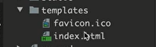
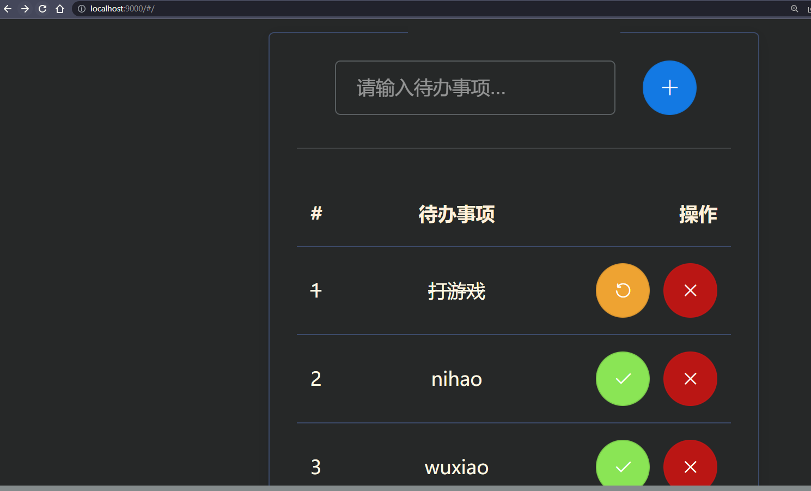

> gin , gorm 的一个小案例

# 重构项目
> 数据库部分的增删改查不太想花时间弄，就不弄了
```
bubble
├── controller：             控制层，获取请求的操作
├── dao：                    专门连接数据库操作的包
├── dist.zip：               前端项目的所有资源
├── go.mod：                 模块依赖文件
├── go.sum：                 模块依赖文件
├── logic：                  逻辑相关的操作，比如需要把数据库中查出的数据进行拼接然后返回给controller层等等
├── main.go：                程序入口，运行文件
├── models：                 关于数据库增删改查的操作都在这个包下
├── readme.md：              说明文件
├── readmePics：             说明文件的图片文件夹
├── routers：                路由相关的
├── static：                 静态资源文件夹，css、js
└── templates：              模板文件夹

```

# 运行的基本逻辑
url请求 —》 controller ——》 logic  ——》 model  
dao在main中连接

# 前端资源
1. `dist.zip`压缩包就是包含了前端所需的资源，直接解压到当前项目目录即可，
2. 创建一个`templates`目录，把图标和`index.html`放进去
    

# 后端
就是`main.go`中的代码，然后就可以跑起来了，效果如下：
