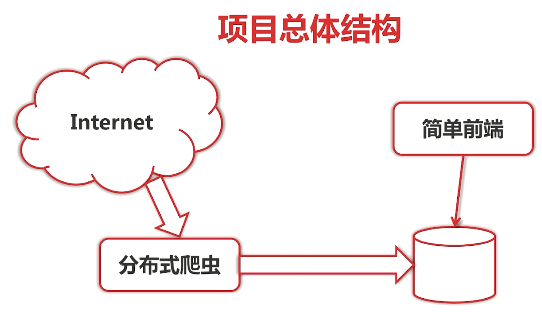
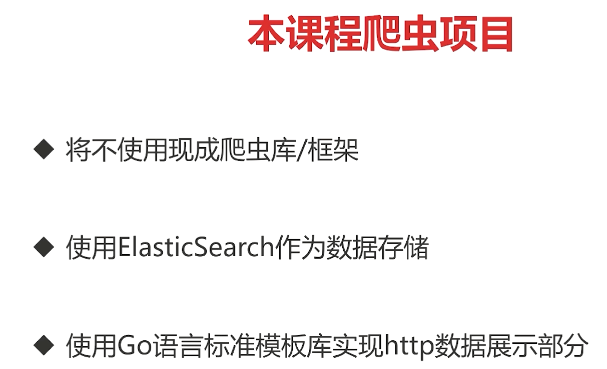
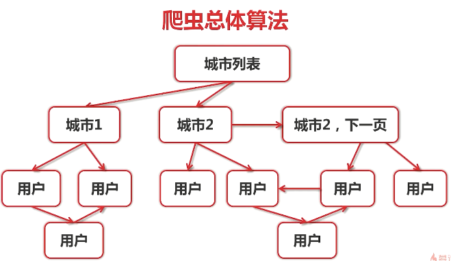
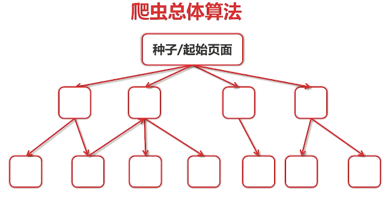
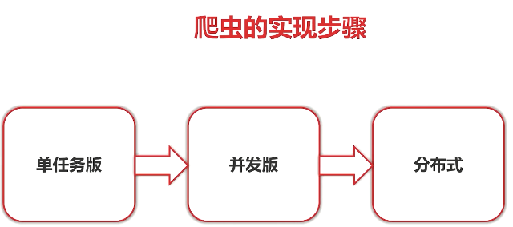
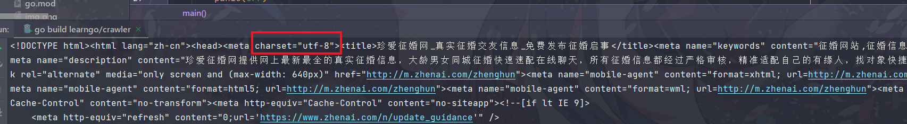

# 简易实战项目——爬虫

## 简单介绍

## 分步实现

# 单任务版
> 项目使用的案例网址，现在已经是utf-8编码了，所以这里会注释不处理编码问题
> 

## gbk转换成utf-8
需要下载一些包
1. 先下载gopm（一个 Go 包管理工具，用于管理 Go 项目的依赖。）：`go get -u github.com/gpmgo/gopm
   `
2. 用`gopm`下载`text`包：`gopm get -g -v golang.org/x/text`