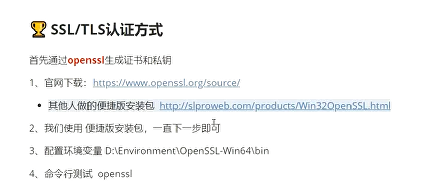
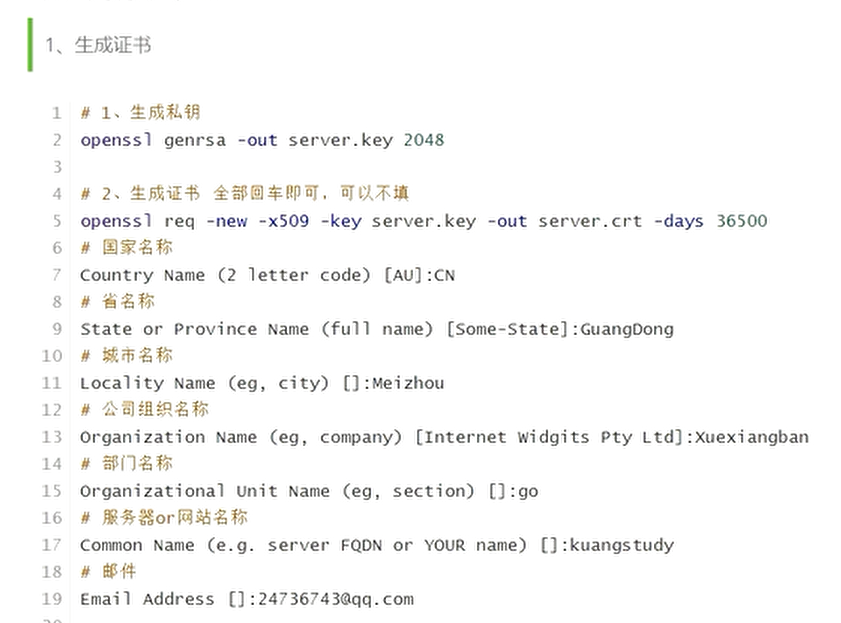
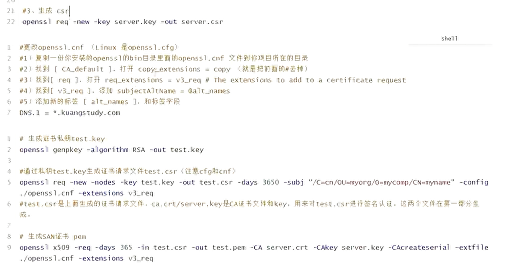

# source
bilibili狂神说的grpc教程，仅作为学习参考。

# stream
在 HTTP/1.1 的时代，同一个时刻只能对一个请求进行处理或者响应，换句话说，下一个请求必须要等当前请求处理完才能继续进行。

> HTTP/1.1需要注意的是，在服务端没有response的时候，客户端是可以发起多个request的，但服务端依旧是顺序对请求进行处理, 并按照收到请求的次序予以返回。

HTTP/2 的时代，多路复用的特性让一次同时处理多个请求成为了现实，并且同一个 TCP 通道中的请求不分先后、不会阻塞，HTTP/2 中引入了流(Stream) 和 帧(Frame) 的概念，当 TCP 通道建立以后，后续的所有操作都是以流的方式发送的，而二进制帧则是组成流的最小单位，属于协议层上的流式传输。

> HTTP/2 在一个 TCP 连接的基础上虚拟出多个 Stream, Stream 之间可以并发的请求和处理, 并且 HTTP/2 以二进制帧 (frame) 的方式进行数据传送, 并引入了头部压缩 (HPACK), 大大提升了交互效率

## 定义
```protobuf
  // 普通 RPC
  rpc SimplePing(PingRequest) returns (PingReply);

  // 客户端流式 RPC
  rpc ClientStreamPing(stream PingRequest) returns (PingReply);

  // 服务器端流式 RPC
  rpc ServerStreamPing(PingRequest) returns (stream PingReply);

  // 双向流式 RPC
  rpc BothStreamPing(stream PingRequest) returns (stream PingReply);
```

stream关键字，当该关键字修饰参数时，表示这是一个客户端流式的 gRPC 接口；当该参数修饰返回值时，表示这是一个服务器端流式的 gRPC 接口；当该关键字同时修饰参数和返回值时，表示这是一个双向流式的 gRPC 接口。

# install
1. 官网[下载](https://github.com/protocolbuffers/protobuf/releases?page=2)grpc编译器，然后把安装路径一直到bin文件夹下配置到环境变量中。
2. 下载go的依赖：
   ```
   go get google.golang.org/grpc
   
   go install google.golang.org/protobuf/cmd/protoc-gen-go@latest
   go install google.golang.org/grpc/cmd/protoc-gen-go-grpc@latest
   ```
3. 这儿有个小小的坑，`github.com/go1ang/protobuf/protoc-gen-go`和 `goog1e.go1ang.org/protobuf/cmd/protoc-gen-go`是不同的。区别在于*前者是旧版本*，**后者**是google接管后的**新版本**，他们之间的API是不同的，也就是说用于生成的命令，以及生成的文件都是不一样的。因为目前的grpc-go源码中的example用的是后者的生成方式，为了与时俱
   进，我们也采取最新的方式。
4. 在编写代码时，如果没有相关高亮显示，需要安装插件，直接搜索protoc

# 生成go、rpc代码
1. `hello.proto`是定义grpc服务、参数、返回的文件；下面两条是执行下面命令后产生的文件。
2. `hello_grpc.pb.go`里面就是接口服务的逻辑
3. `hello.pb.go`里面是参数和返回值的结构体定义
```
//注意proto文件的位置；点表示在当前位置生成
protoc --go_out=. hello.proto //生成go语言文件，对应的是hello.pb.go
protoc --go-grpc_out=. hello.proto  //生成grpc文件，对应hello_grpc.pb.go
```

# 代码编写基本流程
1. 先写对应的`proto`文件，然后用命令生成go文件和grpc文件
2. go代码编写，详细参考下面流程


## 服务端编写
1. 创建gRPC Server对象，你可以理解为它是Server端的抽象对象
2. 将server(其包含需要被调闲的服务端接口)注册到gRPC Server的内部注册中心。 这样可以在接受到请求时，通过内部的服务发现，发现该服务端接口并转接进行罗银处理
3. 创建Listen,监听TCP端口
4. gRPC Server开始Iis.Accept,直到Stop
## 客户端编写
1. 创建与给定目标（服务端）的连接交互
2. 创建server的客户端对象
3. 发送RPC请求，等待同步响应，得到回调后返回响应结果
4. 输出晌应结果

# 认证--安全传输

1. `key`:服务器上的私钥文件，用于对发送给客户端数据的加密，以及对从客户端接收到数据的解密
2. `csr`:证书签名请求文件，用于提交给证书颁发机构(CA)对证书签名。
3. `crt`:由证书颁发机构(CA)签名后的证书，或者是开发者自签名的证书，包含证书持有人的信息，持有人的公钥，以及签署者的签名等信息。
4. `pem`:是基于Base64编码的证书格式，扩展名包括PEM、CRT和CER。

## 什么是 SAN？

SAN（Subject Alternative Name）是 SSL 标准 x509 中定义的一个扩展。使用了 SAN 字段的 SSL 证书，可以扩展此证书支持的域名，使得一个证书可以支持多个不同域名的解析。


# SSL/TLS认证方式



简单来说就是安装openssl的安装包，然后添加到环境变量中去，最后用命令行来生成指定的密钥文件
官网下载需要编译才行，这里直接用别人已经弄好的安装包：
https://slproweb.com/products/Win32OpenSSL.html

```
//生成私钥文件(随便输入一个字符密码,这个密码在后面的openssl命令中会要求输入)
openssl genrsa -out server.key 2048

//生成证书请求（这一步报错看下面的设置，可以全部回车、不填的；如果需要填写可以看一些提示的什么）
openssl req -new -x509 -key server.key -out server.crt -days 36500

//=======================begin=======================
//更改openssl.cfg(Linux是openssl.cnf)
//1)复制一份你安装的openssl的bin目录里面的openssl.cnf文件到你项目所在的目录
//2)找到[CA_default],copy_extensions = copy(就是把前面的#去掉)
//3)找到[req].打开req_extensions = v3_req  #The extensions to add to a certificate request
//4)找到[v3_req],添加subjectAltName = @alt_names
//5〉添加新的标兹[alt_names],和标签字段
DNS.1 = *.codewater.com
//===================================================

//生成csr文件
openssl req -new -key server.key -out server.csr


//生成客户端证书私钥client.key
openssl genpkey -algorithm RSA -out client.key

//通过私钥client.key生成证书请求文件client.csr(注意cfg和cnf)
openssl req -new -x509 -nodes -key client.key -out client.csr -days 3650 -subj "/C=cn/OU=myorg/O=mycomp/CN=myname" -config ./openssl.cfg -extensions v3_req

//client.csr是上面生成的证书请求文件，ca.crt/server.key是CA证书文件和key,用来对client.csr进行签名认证，这两个义件在第一部分生成。

//生成SAN证书 pem
openssl x509 -req -days 365 -in client.csr -out client.pem -CA server.crt -CAkey server.key -CAcreateserial -extfile ./openssl.cfg -extensions v3_req
```

